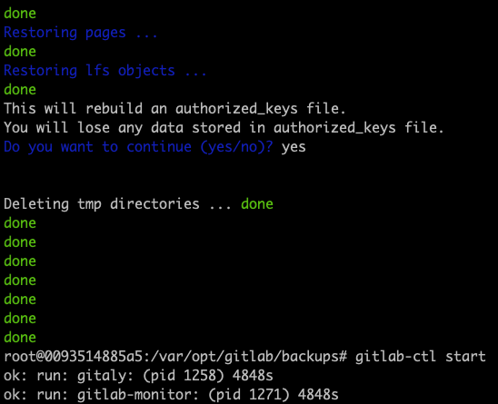

# Gitlab版本管理

## 参考

* [中文社区版github](https://github.com/twang2218/gitlab-ce-zh)

## 安装（基于docker）

以10.2.8版本为例，docker-compose.yml文件如下：

```yml
version: '2'
services:
  gitlab:
    container_name: gitlab
    image: twang2218/gitlab-ce-zh:10.2.8
    # 服务硬件需求，500人以下：2Core，6G内存，100G硬盘
    cpu_quota: 200000
    mem_limit: 4G
    restart: unless-stopped
    # hostname: 'gitlab.example.com'
    environment:
        TZ: 'Asia/Shanghai'
        GITLAB_OMNIBUS_CONFIG: |
          gitlab_rails['time_zone'] = 'Asia/Shanghai'
        #   external_url 'http://gitlab.example.com'
        #   需要配置到 gitlab.rb 中的配置可以在这里配置，每个配置一行，注意缩进。
        #   比如下面的电子邮件的配置：
        #   gitlab_rails['smtp_enable'] = true
        #   gitlab_rails['smtp_address'] = "smtp.exmail.qq.com"
        #   gitlab_rails['smtp_port'] = 465
        #   gitlab_rails['smtp_user_name'] = "xxxx@xx.com"
        #   gitlab_rails['smtp_password'] = "password"
        #   gitlab_rails['smtp_authentication'] = "login"
        #   gitlab_rails['smtp_enable_starttls_auto'] = true
        #   gitlab_rails['smtp_tls'] = true
        #   gitlab_rails['gitlab_email_from'] = 'xxxx@xx.com'
    ports:
        - '22:22'
        - '80:80'
        - '443:443'
    volumes:
        # 提前在大磁盘/data下建立相关目录：/data/gitlab
        - /data/gitlab/etc/gitlab:/etc/gitlab
        - /data/gitlab/log/gitlab:/var/log/gitlab
        - /data/gitlab/opt/gitlab:/var/opt/gitlab
    # extra_hosts:
    #     - "gitlab.example.com:0.0.0.0"
```

* `docker-compose up -d`启动
  * 第一启动时，重置root密码
* `docker-compose down`停止服务

### 集成ldap认证

### 配置mail服务

## 备份和恢复

官方版：

```bash
# 备份，在docker中执行
gitlab-rake gitlab:backup:create
# 在/var/opt/gitlab/backups中生成类似：1555502732_2019_04_17_10.2.8_gitlab_backup.tar
```


```bash
# 从备份中恢复，先停止服务
gitlab-ctl stop unicorn
gitlab-ctl stop sidekiq
# 从指定编号备份中恢复
gitlab-rake gitlab:backup:restore BACKUP=1555502732_2019_04_17_10.2.8
# 重启服务
gitlab-ctl start
```




暴力版：

```bash
# 停docker，备份，直接把data打包，生成类似：gitback-2019-04-18.tar.gz
tar -zcvf /backup/data/gitback-${DATE}.tar.gz -C /data/

# 恢复，再重启docker
tar -xf gitback-2019-04-18.tar.gz -C /data/
docker-compose up -d
```