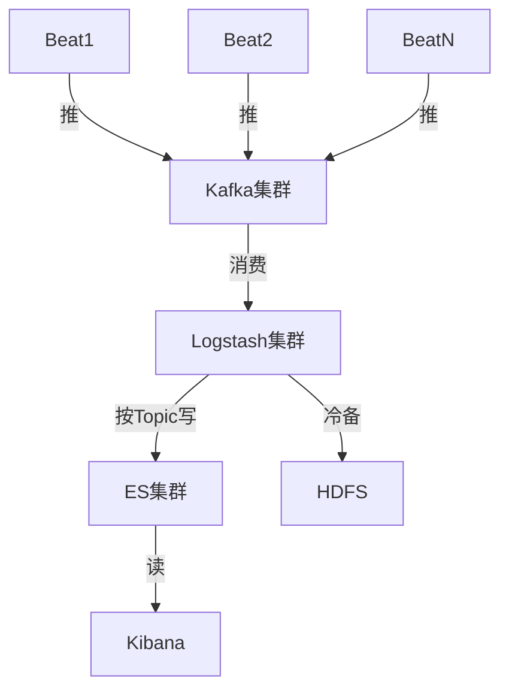

# ELK集群安装配置手册（Docker版）

<!-- toc -->

## 参考

* [官方文档](https://www.elastic.co/guide/)
* [索引管理工具curator](https://github.com/elastic/curator)
* [ELK 架构和 Filebeat 工作原理详解](https://developer.ibm.com/zh/articles/os-cn-elk-filebeat/)

## 架构



## 安装

### Elasticsearch

```bash
# 准备外挂目录
mkdir /opt/elasticsearch
chmod 777 /opt/elasticsearch

# 开发环境，单节点，限制内存，禁用swap，外挂数据
docker pull elasticsearch:7.8.1
docker run -d \
    --name=elasticsearch \
    -p 9200:9200 \
    -p 9300:9300 \
    -v /opt/elasticsearch:/usr/share/elasticsearch/data \
    -e "discovery.type=single-node" \
    -e "ES_JAVA_OPTS=-Xms2000m -Xmx2000m" \
    -m 2g \
    --memory-swap="2g" \
    elasticsearch:7.8.1

# 验证
curl 0.0.0.0:9300
```

#### 注意事项

* 宿主机的`/etc/sysctl.conf`设置`vm.max_map_count=262144`，`sysctl -p`起效
  * 调大单个进程可以拥有的VMA(虚拟内存区域)的数量，否则容易OOM

### Kibana

```bash
docker pull kibana:7.8.1
docker run \
  --link elasticsearch:elasticsearch \
  -p 5601:5601 \
  kibana:7.8.1
```

访问`http://主机:5601`查看效果
