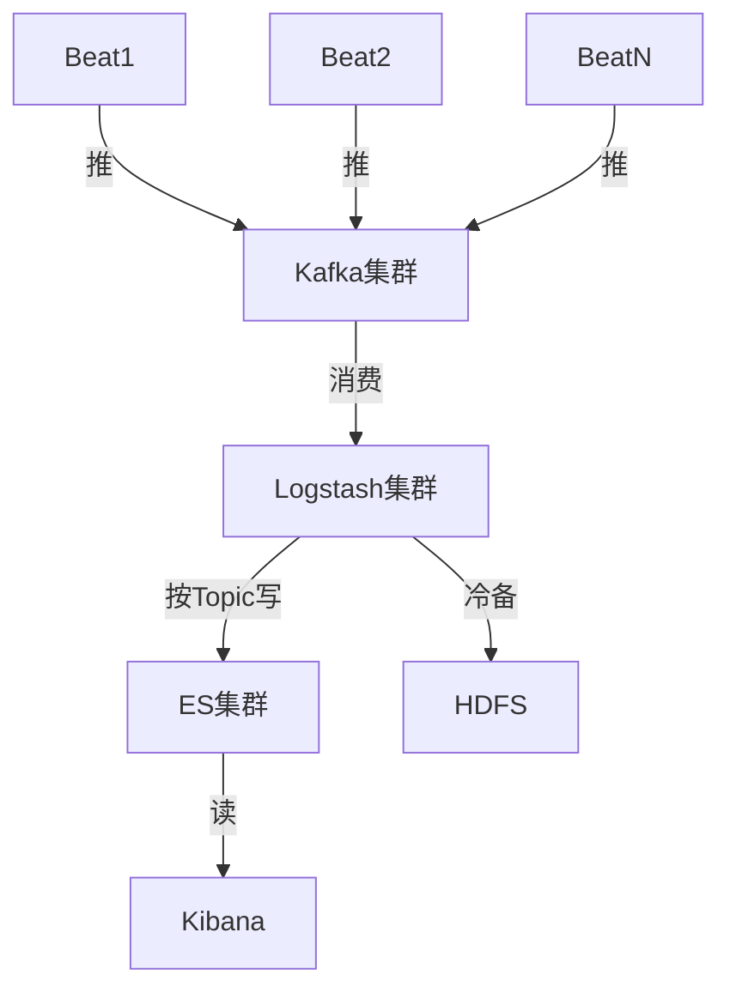

# ELK集群安装配置手册（Docker版）

<!-- toc -->

## 参考

* [官方文档](https://www.elastic.co/guide/)
* [索引管理工具curator](https://github.com/elastic/curator)
* [ELK 架构和 Filebeat 工作原理详解](https://developer.ibm.com/zh/articles/os-cn-elk-filebeat/)
* [监控方案Elasticsearch Exporter](https://github.com/justwatchcom/elasticsearch_exporter)

## 架构



## 安装

### Elasticsearch

```bash
# 准备外挂目录
mkdir /opt/elasticsearch
chmod 777 /opt/elasticsearch

# 开发环境，单节点，限制内存，禁用swap，外挂数据
docker pull elasticsearch:7.8.1
docker run -d \
    --name=elasticsearch \
    -p 9200:9200 \
    -p 9300:9300 \
    -v /opt/elasticsearch:/usr/share/elasticsearch/data \
    -e "discovery.type=single-node" \
    -e "ES_JAVA_OPTS=-Xms2000m -Xmx2000m" \
    -m 2g \
    --memory-swap="2g" \
    elasticsearch:7.8.1

# 验证
curl 0.0.0.0:9300
```

#### 注意事项

* 宿主机的`/etc/sysctl.conf`设置`vm.max_map_count=262144`，`sysctl -p`起效
  * 调大单个进程可以拥有的VMA(虚拟内存区域)的数量，否则容易OOM

#### 监控方案

基于Prometheus Exporter

```bash
# 新建elasticsearch_exporter目录
mkdir /opt/elasticsearch_exporter
cd /opt/elasticsearch_exporter
# 生成docker-compose.yml，参考下文
# 运行
docker-compose up -d
```

```yml
# docker-compose.yml，用于定义elasticsearch_exporter的启动参数
elasticsearch_exporter:
    image: justwatch/elasticsearch_exporter:1.1.0
    command:
     - '--es.uri=http://10.10.0.140:9200'
    restart: always
    ports:
    - "0.0.0.0:9114:9114"
```

##### 常用指标

| 指标 | 监控目标 | 类型 | 单位 | 意义 |
| ---- | ---- | ---- | ---- | ---- |
| elasticsearch_cluster_health_up | 集群 | gauge | 字典 | ES集群的存活状态，1=运行；0=宕机 |
| elasticsearch_cluster_health_active_shards | 集群 | gauge | 正整数 | 分片总数量，包括副本 |
| elasticsearch_cluster_health_unassigned_shards | 集群 | gauge | 正整数 | 未分配的分片数，大于总分片数的50%，代表集群异常 |
| elasticsearch_jvm_memory_max_bytes | node | gauge | byte | jvm最大内存数，由Xmx指定 |
| elasticsearch_jvm_memory_used_bytes{area="heap"} | node | gauge | byte | node的jvm使用的堆内存数，大于总内存的85%代表异常 |

### Kibana

```bash
docker pull kibana:7.8.1
docker run \
  --link elasticsearch:elasticsearch \
  -p 5601:5601 \
  kibana:7.8.1
```

访问`http://主机:5601`查看效果

### Kafka

参考 [kafka教程](/doc/tech_tutorial/中间件/kafka.md)

### Logstash

```bash
docker pull logstash:7.8.1
# 准备放配置的目录
mkdir /opt/logstash
chmod 777 /opt/logstash
cd /opt/logstash
# 生成相关配置文件，参考下面
# 启动
docker run \
  -d \
  --name=logstash \
  --rm \
  -v /opt/logstash/:/usr/share/logstash/config/ \
  logstash:7.8.1 -f /usr/share/logstash/config/logstash.conf
```

```yml
# logstash.yml用于配置
http.host: "0.0.0.0"
```

```conf
# logstash.conf用于说明pipeline
input {
  # syslog
  kafka {
    bootstrap_servers => "10.10.0.106:32775,10.10.0.106:32776"
    topics => ["syslog"]
    codec => "json"
    consumer_threads => 3
    id => "syslog"
  }
}

filter {
    grok {
      match => { "message" => "%{SYSLOGTIMESTAMP:syslog_timestamp} %{SYSLOGHOST:syslog_hostname} %{DATA:syslog_program}(?:\[%{POSINT:syslog_pid}\])?: %{GREEDYDATA:syslog_message}" }
      add_field => [ "received_at", "%{@timestamp}" ]
    }
    date {
      match => [ "syslog_timestamp", "MMM  d HH:mm:ss", "MMM dd HH:mm:ss" ]
    }
}

output {
  # 进内部es
  elasticsearch {
    hosts => ["10.10.0.140:9200"]
    index => "syslog-%{+YYYY.MM.dd}"
    id => "dev-es"
    # 指定模板，解决单节点有副本，造成集群状态yellow的问题
    template => "/usr/share/logstash/config/syslog.json"
    template_name => "syslog-*"
    template_overwrite => true
  }
}
```

```json
// syslog.json，由于默认1分片1副本，会在单实例上造成unassign shard，导致yellow，这里设置不要副本
{
    "template": "syslog-*",
    "settings": {
      "number_of_replicas" : 0
    }
}
```

### Filebeat

```bash
# 安装解压
curl -L -O https://artifacts.elastic.co/downloads/beats/filebeat/filebeat-7.8.1-linux-x86_64.tar.gz
tar xzvf filebeat-7.8.1-linux-x86_64.tar.gz
mv filebeat-7.8.1-linux-x86_64 filebeat
cd filebeat
# 生成配置文件filebeat_syslog.yml
# 测试配置是否正确
./filebeat test config -c filebeat_syslog.yml
# 如果需要读系统log，需要filebeat的权限chown root
# 启动
./filebeat -e -c filebeat_syslog.yml
```

```yml
filebeat.inputs:
# filebeat_syslog.yml 用于采集本机syslog
- type: log
  enabled: true
  paths:
    - /var/log/messages
  fields:
    kafka_topic: syslog  # 和kafka上定义的topic对应

  # 忽略1h前的内容
  # ignore_older: 1h

# 输出
#output.console:
#  pretty: true
output:
  kafka:
    hosts: ["10.10.0.106:32775", "10.10.0.106:32776"]
    topic: '%{[fields][kafka_topic]}'
    compression: snappy
```
