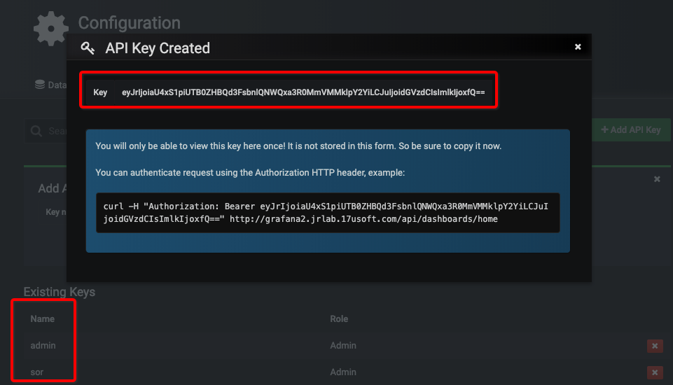

# Grafana可视化监控仪表盘

## 安装（基于docker）

```bash
# 数据和工作目录
mkdir -p /data/grafana/data /data/grafana/log /opt/grafana-conf

# docker启动
docker run -d \
  -p 3000:3000 \
  --name=grafana \
  -e "GF_SERVER_ROOT_URL=http://grafana.your.com" \
  -e "GF_SECURITY_ADMIN_PASSWORD=admin" \
  -e "GF_INSTALL_PLUGINS=alexanderzobnin-zabbix-app" \
  --user $(id -u) \
  --volume "/data/grafana/data:/var/lib/grafana" \
  --volume "/data/grafana/log:/var/log/grafana" \
  # --volume "/opt/grafana-conf/dashboards:/usr/share/grafana/public/dashboards" \
  # --volume "/opt/grafana-conf/grafana.ini:/etc/grafana/grafana.ini" \
  --volume "/etc/localtime:/etc/localtime" \
  grafana/grafana:5.3.4
```

* GF_SECURITY_ADMIN_PASSWORD 管理员密码
* GF_INSTALL_PLUGINS 预安装的插件
* --user $(id -u) 容器读写外挂磁盘，需要当前用户权限

## 更新配置流程

1. 更新本git库
2. 上生产环境的配置目录（/opt/grafana-conf/）执行git pull
3. 执行`docker restart grafana`

## 导出和导入

* 参考：https://github.com/hagen1778/grafana-import-export
* 依赖：jq - commandline JSON processor
* 配置：
  * 更新`config.sh`中的 **HOST** 和 **FILE_DIR**
  * **ORGS** 数组，写申请对应的 Name:API_KEY



```bash
# 导出
./exporter.sh
# 输出结果类似：
elastalert-xxx.json
  % Total    % Received % Xferd  Average Speed   Time    Time     Time  Current
                                 Dload  Upload   Total   Spent    Left  Speed
100  1939  100  1939    0     0  33215      0 --:--:-- --:--:-- --:--:-- 33431

# 全导入
./importer.sh

# 指定导入，支持*
./importer.sh data/{Name}/dashboards/dashboard.json data/{Name}/datasources/*.json
```

* 踩坑
  * dashboards中有随机url，建议不要用导出的json，而是用提前在老Grafana上用“Export”按钮导出的json，再一个个导入