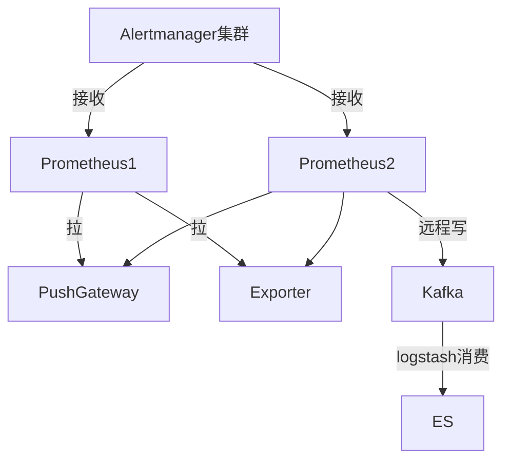
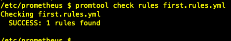
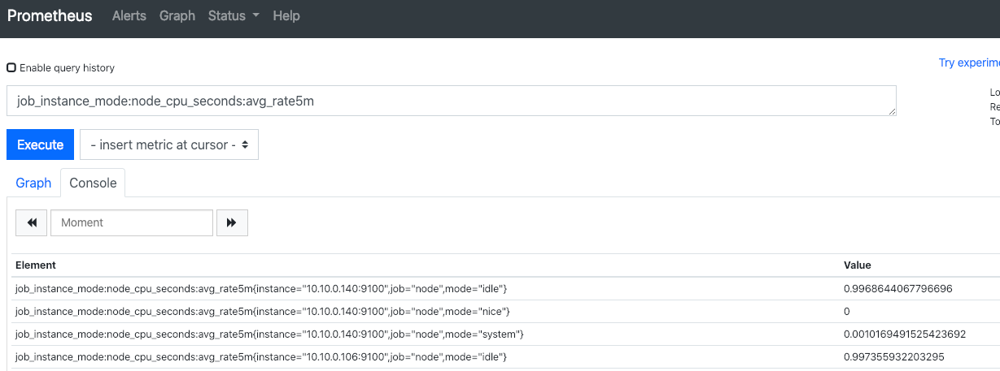
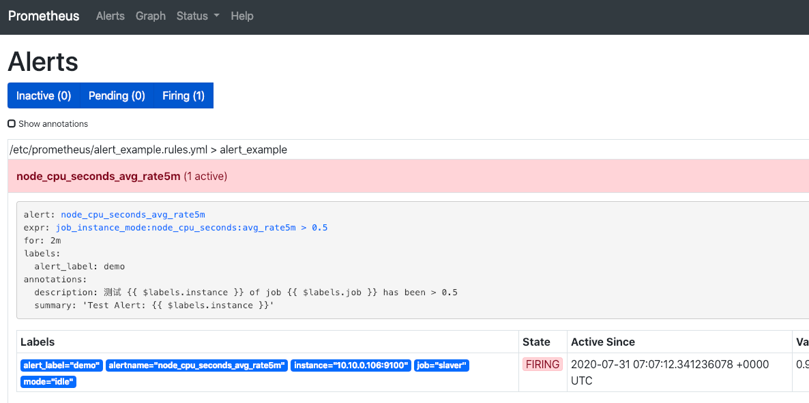
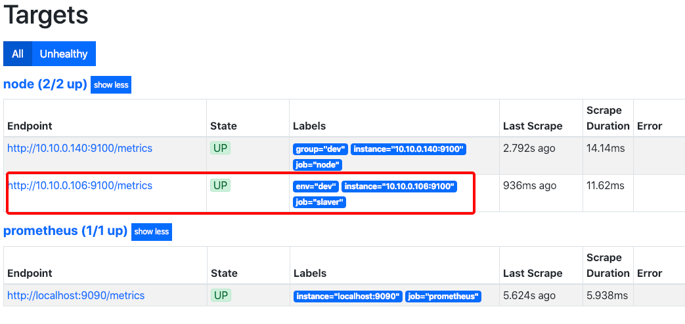
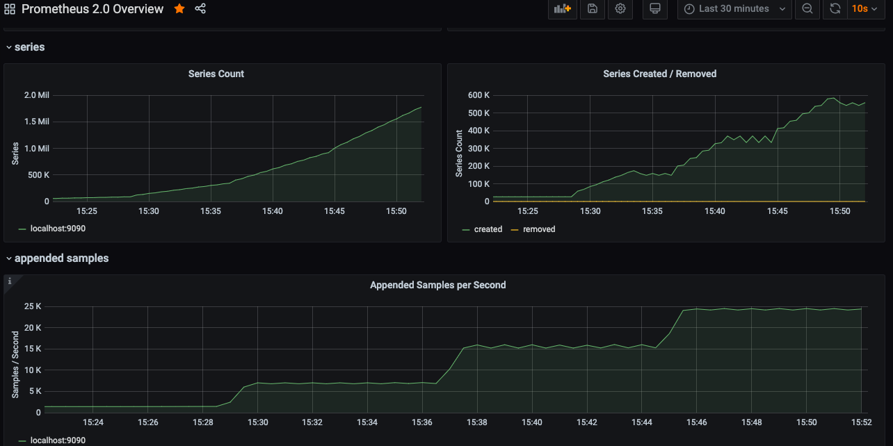
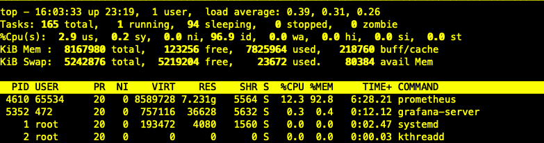
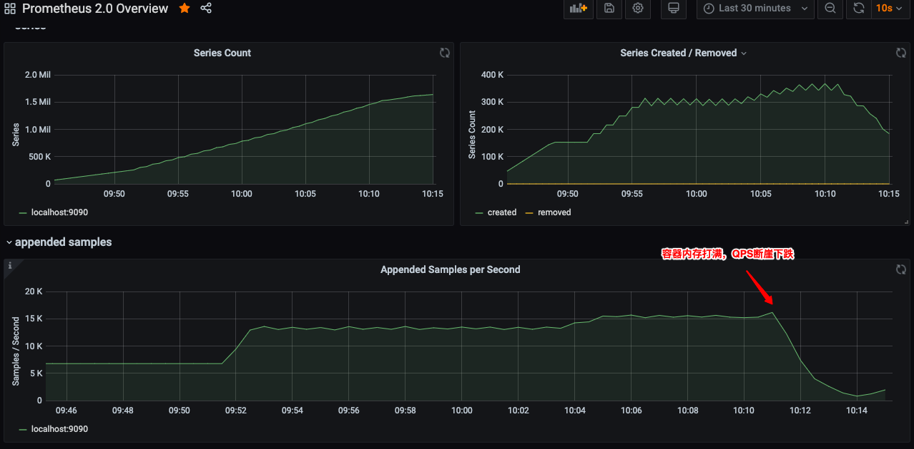

# Prometheus 使用手册

<!-- toc -->

## 参考

* [官网](https://prometheus.io/)
* [中文教程](https://yunlzheng.gitbook.io/prometheus-book/)
* [压测方案](https://blog.freshtracks.io/load-testing-prometheus-metric-ingestion-5b878711711c)

## 架构

* 高可用：
  * 双Server实例模型
  * 双AlertManager+Nginx的LB
* 数据存储策略：冷热分离
  * 2周内数据：Prometheus-Server的本地存储
  * 2周以外数据：远程写入ES
* 支持告警规则动态加载：
  * 基于联邦模型，规则加载在上层Prometheus-Server下，实现蓝绿切换
  * 告警规则存储在git中，定期检查更新



## 安装

### 环境准备

* 升级yum源，参考：<https://developer.aliyun.com/mirror/centos>
* 配置时间ntp同步，TSDB核心指标
* 适配docker，升级内核，[参考](/doc/tech_tutorial/linux工具/kernel.md)
* 安装docker-ce，[参考](/doc/tech_tutorial/虚拟化/docker.md)

### 配置

```yml
# 在"/opt/prometheus"下生成配置prometheus.yml
global:
  scrape_interval:     15s  # 采集间隔时间
  evaluation_interval: 15s  # 执行规则的间隔时间
rule_files:  # 加载规则
  - "first.rules.yml"  # 适配下文的自定义Metric
  - "alert_example.rules.yml"  # 适配下文的自定义告警
scrape_configs:  # 监控目标
  - job_name: prometheus
    static_configs:
      - targets: ['localhost:9090']  # 默认采集HTTP地址：http://localhost:9090/metrics
  - job_name: node  # 适配下方的主机节点监控
    scrape_interval: 5s  # 覆盖全局变量

    file_sd_configs:  # 读服务发现目标文件，支持*通配符，适配下文服务发现
      - files:
        - sd_config.json
        refresh_interval: 10m  # 10分钟执行一次发现，默认5m
    static_configs:
      - targets: ['宿主机IP:9100']  # 如果server是docker启动，这里需要明确ip
        labels:
          group: 'dev'  # 自定义标签，dev组
# 对接Alertmanager
alerting:
  alertmanagers:
    - static_configs:
        - targets:
          - '宿主机IP:9093'
```

### 启动

```bash
# 指定配置路径，暴露9090端口，限制最大内存，数据保留7天
docker run -d --name=prometheus \
    -m 4G \
    --restart=always \
    -p 9090:9090 \
    -v /opt/prometheus:/etc/prometheus \
    prom/prometheus:v2.19.3

# 带参数启动
docker run \
  --name=prometheus \
  --volume=/opt/prometheus:/etc/prometheus \
  --volume=/prometheus \
  -p 9090:9090 \
  --restart=always \
  --detach=true prom/prometheus:v2.19.3 \
  --storage.tsdb.retention.time=7d \
  --config.file=/etc/prometheus/prometheus.yml \
  --storage.tsdb.path=/prometheus \
  --web.console.libraries=/usr/share/prometheus/console_libraries \
  --web.console.templates=/usr/share/prometheus/consoles
```

## 使用

### 主机Node Exporter

```bash
# 下载组件
wget https://github.com/prometheus/node_exporter/releases/download/v1.0.1/node_exporter-1.0.1.linux-amd64.tar.gz
# 解压后启动
tar xvfz node_exporter-1.0.1.linux-amd64.tar.gz
mv node_exporter-1.0.1.linux-amd64/ node_exporter
cd node_exporter/
nohup ./node_exporter &
```

注意：关闭主机上防火墙`systemctl stop firewalld`

### 自定义Metric

适用于原有数据的预计算。

```yml
# 在"/opt/prometheus"下生成yml规则文件 first.rules.yml
groups:
- name: cpu-node
  rules:
  - record: job_instance_mode:node_cpu_seconds:avg_rate5m  # 每秒CPU时间速率，按照job、实例、模式区分，5分钟均值
    expr: avg by (job, instance, mode) (rate(node_cpu_seconds_total[5m]))
```

```bash
# 验证规则文件是否正确
promtool check rules first.rules.yml
```



页面效果如下 

### 自定义告警

```yml
# 在配置目录下定义告警规则文件 alert_example.rules.yml
groups:
- name: alert_example
  rules:
  - alert: node_cpu_seconds_avg_rate5m
    expr: job_instance_mode:node_cpu_seconds:avg_rate5m  > 0.5
    for: 2m
    labels:
      alert_label: demo
    annotations:
      summary: "Test Alert: {{ $labels.instance }}"
      description: "测试 {{ $labels.instance }} of job {{ $labels.job }} has been > 0.5"
```

在Prometheus的conf中启用，效果如下 

### 服务发现基于文件

```json
// 在配置目录下定义监控服务目标的 sd_config.json
[
  {
    "targets": ["10.10.0.106:9100"],
    "labels": {
      "env": "dev",
      "job": "slaver"  // 会覆盖上层label
    }
  }
]
```

在Prometheus的conf中启用，效果如下 

## 常用PromQL举例

```
# 瞬时向量表达式：按照bu, product维度区分，计算指标和
sum(es_inte_applog_error_count_group_by_servername_last_min) by (bu, product)

# 瞬时向量表达式：按照bu, product维度区分，计算指标和，5分钟前的数据
sum(es_inte_applog_error_count_group_by_servername_last_min offset 5m) by (bu, product) 

# 计算指标个数
count(es_inte_applog_error_count_group_by_servername_last_min)

# 区间向量表达式：只能用于表格，获取指定指标 5分钟内的所有样本数据
es_inte_applog_error_count_group_by_servername_last_min{product="INS"}[5m]

# 瞬时向量表达式：获取指定指标 5分钟内的所有样本数据之和  sum_over_time(range-vector)：指定时间间隔内所有值的总和
sum_over_time(es_inte_applog_error_count_group_by_servername_last_min{product="INS"}[5m])
```

## 性能压测报告

测试主机配置：4C8G

* 不限制docker内存
  * 压测到22个avalanche实例时，达到24k的QPS，内存占用7.7G，随后卡机 
  * 主机CPU负载不大，内存占用持续增加，上不封顶
  * 在停止Prometheus服务时，主机负载瞬间飚高，造成VM卡住，最后重启恢复
* 限制Prometheus容器内存4G
  * 14节点=15.5kQPS，内存~=3.9G，容器内存基本打满，出现服务不稳定，执行查询时间变长，QPS突然下降，主机负载开始升高，从0.x升到4，大量磁盘IO 
  * 降低节点数到12后，主机磁盘下降，服务恢复正常，但是内存未释放

结论：

* Prometheus是以Go语言开发，所以并发性能非常强，但是以消耗内存为代价
  * 单实例4G的Prom能支撑12.5K的QPS
  * 当出现查询卡顿时，可以判断采集服务出现问题
  * 在实际使用中，必须限制内存，否则会吃光
* 恢复策略建议：不要恢复原实例，以丢失原数据为代价，开一个新实例
