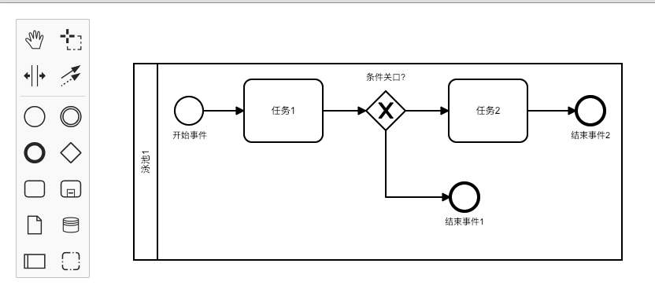

# BPMN 2.0 简介

业务流程模型和标记法（Business Process Model and Notation）是一套图形化表示法，用于以业务流程模型详细说明各种业务流程，是对象管理组织（Object Management Group）维护的行业性标准。

## 要素

1. 流对象（Flow Object）
   1. 事件（Events）以圆环表示，常见：开始事件（只能catch），结束事件（只能throw）
   2. 活动（Activities）用圆角矩形表示：任务，子流程，事务
   3. 关口（Gateways）菱形表示
2. 连接对象（Connecting Objects）
   1. 顺序流（Sequence Flow）实心线和箭头
   2. 消息流（Message Flow）虚线箭头，表明跨越池边界的消息
   3. 关联（Association）点线，连接附加物和流对象
3. 泳道（Swimlanes）
   1. 池（Pool）区分组织，可有多个道
   2. 道（Lane）区分职能
4. 附加物（Artifacts）
   1. 数据对象（Data Object）
   2. 组（Group）虚线的圆角矩形，用于活动分组，不影响流
   3. 注释（Annotation）
