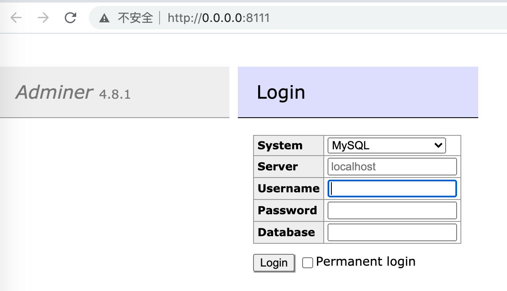

# Adminer 单php的db管理系统

## 使用

```bash
# 下载，注意官方是 https://github.com/vrana/adminer/releases/download/，hub.fastgit.org是国人翻墙加速服务
wget 'https://hub.fastgit.org/vrana/adminer/releases/download/v4.8.1/adminer-4.8.1-en.php'

# 独立启动前提，安装php
php -S 0.0.0.0:8111 adminer-4.8.1-en.php
```

实际效果 

## 参考

* 官网 <https://www.adminer.org/en/>
* 无密码访问sqlite3 <https://github.com/FrancoisCapon/LoginToASqlite3DatabaseWithoutCredentialsWithAdminer>