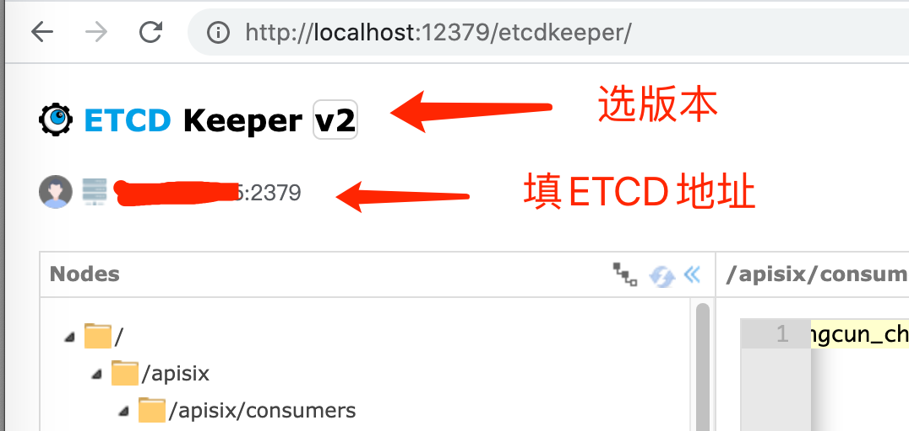

# Etcd 分布式KV数据库

## 安装

### 单节点，Docker版

```bash
docker run \
	--name=etcd \
	--volume=/Users/jeff.chen/opt/etcd/etcd-data/:/etcd-data \
	-p 2379:2379 \
	-p 2380:2380 \
	--restart=always \
	-d quay.io/coreos/etcd:v3.3.14 etcd \
	--data-dir=/etcd-data \
	--advertise-client-urls http://0.0.0.0:2379 \
	--listen-client-urls http://0.0.0.0:2379 \
	# --force-new-cluster  # 可选，用于服务异常后的数据恢复
```

* --data-dir 数据存储目录，这些数据包括节点ID，集群ID，集群初始化配置，Snapshot文件，若未指定--wal-dir，还会存储WAL文件
* --name 节点名称
* --listen-peer-urls 监听URL，用于与其他节点通讯
* --advertise-client-urls 告知客户端url, 也就是服务的url
* --initial-advertise-peer-urls 告知集群其他节点url
* --initial-cluster-token 集群的ID
* --initial-cluster 集群中所有节点
* --force-new-cluster 启动一个新的集群

## 使用

在容器内执行

```bash
# 查看版本，默认API版本是v2，如果要用v3，需要在环境变量中设置ETCDCTL_API=3
etcdctl --version

# 指定目录Key一览
etcdctl ls /your/key/path

# 设置KV
etcdctl set /ops-event-web ops-event-web

# 读取指定Key
etcdctl get /ops-event-web  # 反馈：ops-event-web

# 删除指定Key
etcdctl rm /ops-event-web
```

### Web UI

基于etcdkeeper，访问`http://localhost:12379`

```bash
# docker启动
docker run -d --name etcdkeeper \
	-p 12379:8080 \
	evildecay/etcdkeeper
```



### 数据迁移

1. 停止待迁移节点上的etc进程；
2. 将数据目录打包复制到新的节点；
3. 更新该节点对应集群中peer url，让其指向新的节点；
4. 使用相同的配置，在新的节点上启动etcd进程

```bash
# 备份
etcdctl backup --data-dir /etcd-data/ --backup-dir /etcd_backup/
```

## 常见故障

### 启动时大量报`request sent was ignored (cluster ID mismatch`，节点无法启动

可能原因：节点间通信失败，导致集群无法拉起
解决方案：

1. 删除data-dir 会丢失原数据，但是节点能启动，再从其他节点同步数据过来
2. 启动时加参数--force-new-cluster 强制单节点启动，忽略原集群配置，用于保留数据

### 数据导入后为空

可能原因：备份使用V3 API，但是原节点是V2 API在跑。V3的备份db和V2的读wal是不同策略
解决方案：使用完整的data-dir备份，通过force-new-cluster拉起单节点

## 参考

* Github官网 <https://github.com/etcd-io/etcd>
* 国人翻译的手册 <https://doczhcn.gitbook.io/etcd/>
* etcdkeeper官网 <https://github.com/evildecay/etcdkeeper>