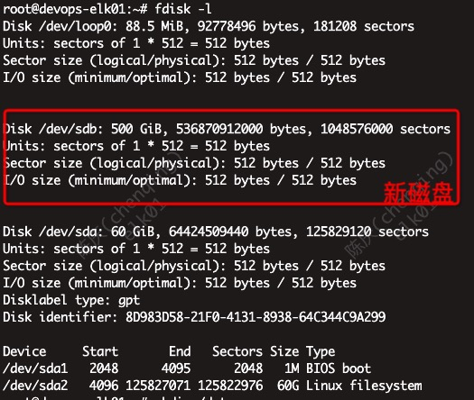
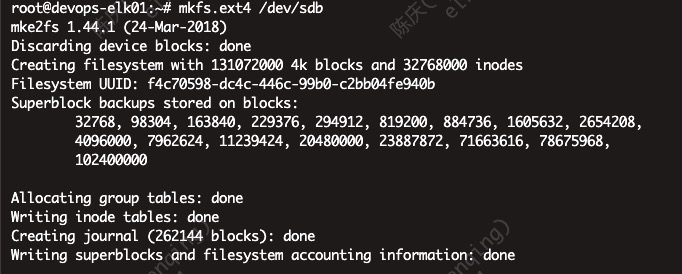
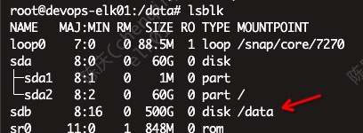

# 挂载data盘

## 目的

格式化新磁盘，挂载到/data下，开机自动

## 方法

1. `fdisk -l` 查看识别到的磁盘 
2. `mkdir /data` 新建挂载的目标目录
3. `mkfs.ext4 /dev/sdb` 格式化 
4. `mount /dev/sdb /data` 挂载目录
5. `cat /etc/mtab | grep /data >> /etc/fstab` 设置开机自动挂载
6. `lsblk` 查看效果 