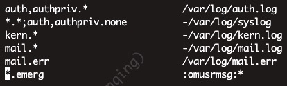

# Rsyslog 系统日志

syslog的升级版，linux一般默认安装，支持多种协议转发，工业标准。

## 使用

以`Ubuntu 18`举例

### 配置

* 默认配置文件`/etc/rsyslog.conf`和`/etc/rsyslog.d`目录
  * 第一行：所有`auth,authpriv.*`相关log写入`/var/log/auth.log`
    * 多个日志来源用`,`号隔开
  * 第二行：所有log，除了`auth,authpriv.none`(`;`后面)异步的(开头`-`指定)写入`/var/log/syslog`
  * 第六行：所有`emerg`级别（导致系统不可用）的信息，使用内置模块`omusrmsg`通知给所有用户`*`
* 默认格式（RSYSLOG_TraditionalFileFormat）`"%TIMESTAMP% %HOSTNAME% %syslogtag%%msg:::sp-if-no-1st-sp%%msg:::drop-last-lf%\n"`
  * TIMESTAMP: timereported的别名，接收消息时的时间戳
  * HOSTNAME: 来自消息的主机名
  * msg: 即消息源进程调用syslog家族函数，所传递的文本信息
  * syslogtag: 来自消息的标签，消息源进程的用户名
  * sp-if-no-1st-sp: 有点像 if 语句。如果存在空格，不执行任何操作。否则，则添加一个空格。用于输出多行的msg
  * drop-last-lf: 丢弃最后的LF
* 常见facility（设施）：标识系统需要记录日志的子系统
```bash
auth             #PAM认证相关日志；
authpriv         #SSH、FTP登录相关日志；
cron             #任务计划相关日志；
daemon           #守护进程相关日志；
kern             #内核相关日志；
mail             #邮件相关日志；
security         #安全相关日志与auth类似；
syslog           #Rsyslog自己的日志；
user             #用户相关日志；
*                #表示所有的facility；
```
* priority（级别）：级别越低信息越详细
```bash
debug            #程序或系统调试信息；
info             #一般信息；
notice           #不影响正常功能需要注意的信息；
warning          #可能影响系统功能提醒用户的重要事件；
error            #错误信息；
crit             #比较严重的信息；
alert            #必须马上处理的警告信息；
emerg/panic      #会导致系统不可用的严重信息；
*                #表示所有日志级别；
none             #跟*相反表示什么都没有；
```
* action（动作）：设置日志记录的位置
  * `/var/log/file.log` 记录到普通文件或设备文件
  * `@192.168.10.1` 日志发送到特定的主机
  * `*` 日志发送所有登录到系统上的用户
* 连接符号
```bash
.                #表示大于等于xxx级别的信息；
.=               #表示等于xxx级别的信息；
.!               #表示在xxx之外的等级的信息；
```

## 参考

* 官网 <https://www.rsyslog.com/>
* 文档 <https://rsyslog-doc.readthedocs.io/>
* 源码 <https://github.com/rsyslog/rsyslog>