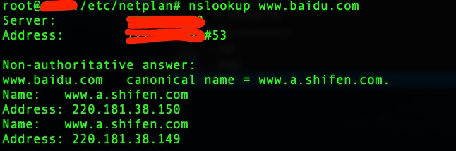
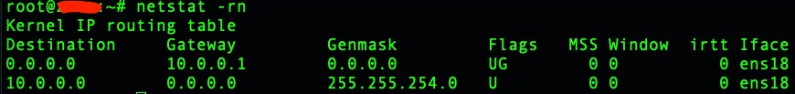

# Ubuntu常用设置

## 系统

### 设置时区

1. `tzselect` 按照向导选择`亚洲-中国-北京`
2. `timedatectl set-timezone "Asia/Shanghai"` 指定显示时区

### 更换hostname

`vim /etc/hostname`

## 网络

### 查询本地DNS

1. `cat /etc/resolv.conf`
2. `nslookup www.baidu.com`的第一行的server的IP


### 查看Gateway

`netstat -rn`中0.0.0.0对应的gateway地址


### 使用固定静态IP

ubuntu18，不再维护`/etc/network/interfaces`里的固定IP，而是改成`/etc/netplan/*.yaml`类似名称的yaml里

1. 修改`/etc/netplan/50-cloud-init.yaml`
```yaml
# This file is generated from information provided by
# the datasource.  Changes to it will not persist across an instance.
# To disable cloud-init's network configuration capabilities, write a file
# /etc/cloud/cloud.cfg.d/99-disable-network-config.cfg with the following:
# network: {config: disabled}
network:
    ethernets:
        ens18:
            dhcp4: false # 关闭自动dhcp
            addresses: [192.168.0.20/23] # 参考 ip a中对应网卡的ip地址和掩码
            optional: true
            gateway4: 192.168.0.1 # 网关地址
            nameservers:
                addresses: [8.8.8.8,114.114.114.114] # 多个DNS地址
    version: 2
```
2. `netplan apply` 配置生效
3. `ping www.baidu.com` 测试