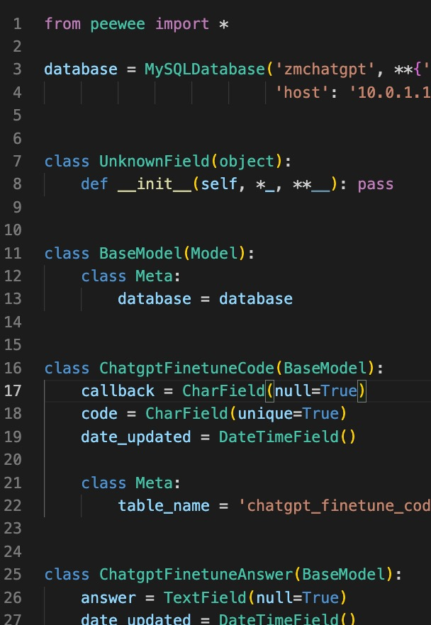

# Peewee python的ORM框架

## 安装

`pip install peewee`

## 使用

### 根据已有DB生成Model

```bash
# pwiz脚本 -e数据库类型 -H数据库地址 -p端口 -u用户名 -P用户密码 -t表名,分隔 数据库名
python -m pwiz -e mysql -H 10.0.1.1 -p 3306 -u zmchatgpt -P -t chatgpt_finetune_answer,chatgpt_finetune_code,chatgpt_finetune_question,chatgpt_finetune_uploadfile,chatgpt_qa_history zmchatgpt > model.py
```


