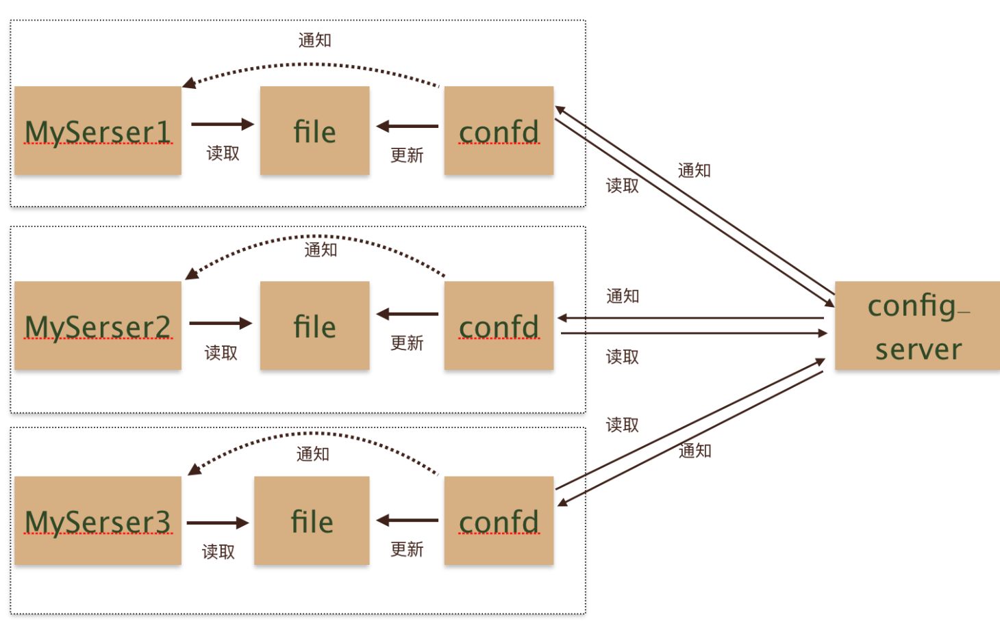
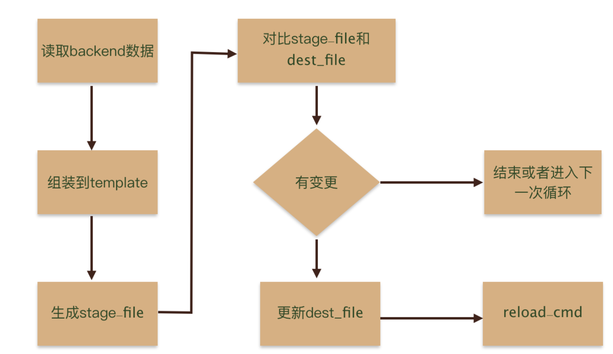
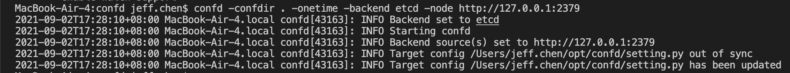
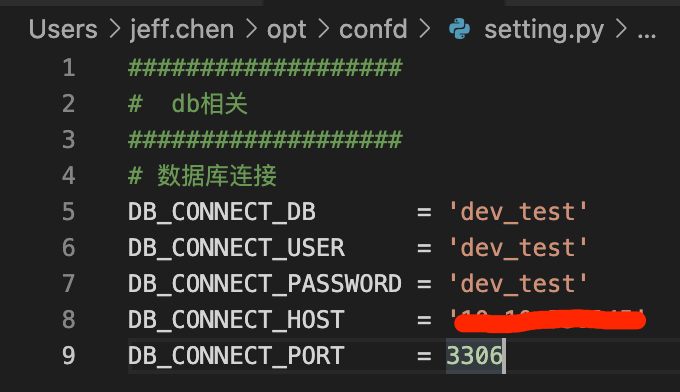

# Confd 服务配置中心

## 架构

配置服务中心的模型


confd工作流程


## 安装

在本地mac上验证通过

```bash
# 下载到专用目录
cd /Users/jeff.chen/opt/confd
wget https://github.com/kelseyhightower/confd/releases/download/v0.16.0/confd-0.16.0-darwin-amd64
mv confd-0.16.0-darwin-amd64 confd
# 设置环境
export PATH="/Users/jeff.chen/opt/confd:$PATH"
# 验证
confd -help
```

## 使用

```bash
# 构建相关目录
cd /Users/jeff.chen/opt/confd
mkdir -p ./{conf.d,templates}
```

编辑conf.d/ops-event-web.toml配置

```toml
[template]
# 模板文件
src = "ops-event-web.tmpl"
# 生成目标配置目录文件
dest = "/Users/jeff.chen/opt/confd/setting.py"

# 监控KEY的改变，改变会自动重新生成配置并重启
keys = [ 
        "/ops-event-web/DB_CONNECT_DB",
        "/ops-event-web/DB_CONNECT_HOST",
        "/ops-event-web/DB_CONNECT_PASSWORD",
        "/ops-event-web/DB_CONNECT_PORT",
        "/ops-event-web/DB_CONNECT_USER",
]

# 执行动作的用户和文件权限
owner = "jeff.chen" 
mode = "0644"

# 执行验证命令和服务重启
check_cmd = "echo 'exec check'"
reload_cmd = "echo 'exec restart'"
```

生成ops-event-web.tmpl，基于go的字符串模板

```golang
###################
#  db相关
###################
# 数据库连接
DB_CONNECT_DB       = '{{getv "/ops-event-web/DB_CONNECT_DB"}}'
DB_CONNECT_USER     = '{{getv "/ops-event-web/DB_CONNECT_USER"}}'
DB_CONNECT_PASSWORD = '{{getv "/ops-event-web/DB_CONNECT_PASSWORD"}}'
DB_CONNECT_HOST     = '{{getv "/ops-event-web/DB_CONNECT_HOST"}}'
DB_CONNECT_PORT     = {{getv "/ops-event-web/DB_CONNECT_PORT"}}
```

```bash
# 运行1次
confd -confdir . -onetime -backend etcd -node http://127.0.0.1:2379

# 持续运行，每隔10s监控key是否变更
confd -confdir . -backend="etcd" -node=http://127.0.0.1:2379 -interval=10
```

执行效果





## 参考

* [github官网](https://github.com/kelseyhightower/confd)
* [Etcd简介](../DB/etcd.md)