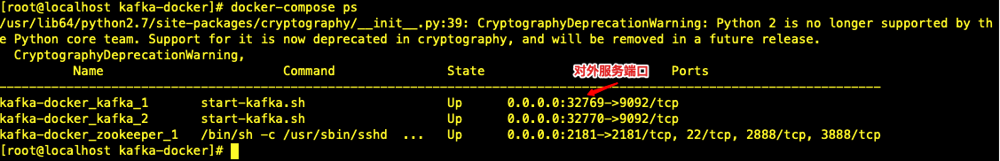

# Kafka集群安装配置手册（Docker版）

<!-- toc -->

## 参考

* [官网](http://kafka.apache.org/)
* [开源kafka集群镜像GitHub](https://github.com/wurstmeister/kafka-docker)
* [开源CMAK镜像GitHub](https://github.com/hleb-albau/kafka-manager-docker)

## 安装

### Kafka

```bash
git clone https://github.com/wurstmeister/kafka-docker.git
cd kafka-docker
# 修改docker-compose.yml的KAFKA_ADVERTISED_HOST_NAME为宿主机IP
# 不建议改kafka.ports，因为scale命令会启动多个容器，都映射9092
# 修改Dockerfile：kafka_version=2.1.1；scala_version=2.12
# 或者docker-compose.yml的kafka.build直接改为image: wurstmeister/kafka:2.12-2.1.1
docker-compose up -d
# (可选扩容)up后，启动2个broker：docker-compose scale kafka=2
# 验证
docker-compose ps
```

```yml
# docker-compose.yml
version: '2'
services:
  zookeeper:
    image: wurstmeister/zookeeper
    ports:
      - "2181:2181"
  kafka:
    # build: .
    image: wurstmeister/kafka:2.12-2.1.1
    ports:
      - "9092"
      # - "9092:9092"  # 如果绑定9092，就不能通过scale扩容
    environment:
      KAFKA_ADVERTISED_HOST_NAME: 宿主机IP
      KAFKA_ZOOKEEPER_CONNECT: zookeeper:2181
      KAFKA_JMX_OPTS: "-Dcom.sun.management.jmxremote -Dcom.sun.management.jmxremote.authenticate=false -Dcom.sun.management.jmxremote.ssl=false -Djava.rmi.server.hostname=127.0.0.1 -Dcom.sun.management.jmxremote.rmi.port=1099"
      JMX_PORT: 1099
    volumes:
      - /var/run/docker.sock:/var/run/docker.sock
```



### CMAK，原Kafka Manager

```bash
git clone https://github.com/hleb-albau/kafka-manager-docker.git
cd kafka-manager-docker
# 新建docker-compose.yml
```

```yml
version: '3.6'
services:
  kafka_manager:
    image: hlebalbau/kafka-manager:stable
    container_name: kafka-manager
    restart: always
    ports:
      - "9000:9000"
    environment:
      ZK_HOSTS: "之前kafka的zk主机ip:2181"
      APPLICATION_SECRET: "random-secret"
      KAFKA_MANAGER_AUTH_ENABLED: "true"  # 开启登入认证
      KAFKA_MANAGER_USERNAME: username
      KAFKA_MANAGER_PASSWORD: password
    command: -Dpidfile.path=/dev/null
```

访问`http://CMAK主机:9000`使用

#### 填坑记录

* 第一次加cluster，页面报`KeeperErrorCode = Unimplemented for /kafka-manager/mutex`

> 原因：在zk中没有初始相关key  
> 解决方案：进docker内，用zkCli手工建相关key，参考<https://github.com/yahoo/CMAK/issues/731>

``` bash
docker exec -it zookeeper bash
# docker内操作
./bin/zkCli.sh
# 进入zk后操作
[zk: localhost:2181(CONNECTED) 0] ls /kafka-manager
[configs, deleteClusters, clusters]
[zk: localhost:2181(CONNECTED) 1] create /kafka-manager/mutex ""
Created /kafka-manager/mutex
[zk: localhost:2181(CONNECTED) 2] create /kafka-manager/mutex/locks ""
Created /kafka-manager/mutex/locks
[zk: localhost:2181(CONNECTED) 3] create /kafka-manager/mutex/leases ""
Created /kafka-manager/mutex/leases
```

* 长时间运行后，磁盘告警，大量持久化log

> 原因：在建topic时，没有指定持久化策略
> 解决方案：新建topic时，设置`retention.ms`为43200000，单位毫秒
