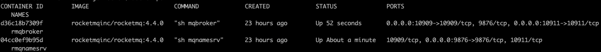

# RocketMQ 分布式MQ和流平台

## 简介

* 开源，Apache2.0
* Pull模式
* 低延时，亿级
* 高可靠，磁盘数据固化
* 易扩容
* 支持Scheduled
* 支持广播
* 支持条件过滤


## 安装（docker版）

__安装需求__：

* 64位，类Unix系统
* JDK 1.8以上
* Broker节点需要4G以上硬盘

```
git clone https://github.com/apache/rocketmq-externals.git
cd rocketmq-externals/rocketmq-docker/4.4.0
./play-docker.sh  # 编译并启动镜像，非常简单人性化
# 测试生产者
docker exec -ti rmqbroker sh ./tools.sh org.apache.rocketmq.example.quickstart.Producer
# 测试消费
docker exec -ti rmqbroker sh ./tools.sh org.apache.rocketmq.example.quickstart.Consumer
```

__启动参数__：

* `-e "MAX_POSSIBLE_HEAP=100000000"`指定jvm内存heap

运行效果:


__优雅关机__：

* `docker exec -ti rmqbroker sh ./mqshutdown broker`先关broker
>
    The mqbroker(28) is running...
    Send shutdown request to mqbroker(28) OK

* `docker exec -ti rmqnamesrv sh ./mqshutdown namesrv`再关namesrv
>
    The mqnamesrv(27) is running...
    Send shutdown request to mqnamesrv(27) OK

## 核心

### 架构图


## 使用（CLI）

用法：`bin/mqadmin <命令> <参数>`

命令如下：
>
    updateTopic          Update or create topic
    deleteTopic          Delete topic from broker and NameServer.
    updateSubGroup       Update or create subscription group
    deleteSubGroup       Delete subscription group from broker.
    updateBrokerConfig   Update broker's config
    updateTopicPerm      Update topic perm
    topicRoute           Examine topic route info
    topicStatus          Examine topic Status info
    topicClusterList     get cluster info for topic
    brokerStatus         Fetch broker runtime status data
    queryMsgById         Query Message by Id
    queryMsgByKey        Query Message by Key
    queryMsgByUniqueKey  Query Message by Unique key
    queryMsgByOffset     Query Message by offset
    printMsg             Print Message Detail
    printMsgByQueue      Print Message Detail
    sendMsgStatus        send msg to broker.
    brokerConsumeStats   Fetch broker consume stats data
    producerConnection   Query producer's socket connection and client version
    consumerConnection   Query consumer's socket connection, client version and subscription
    consumerProgress     Query consumers's progress, speed
    consumerStatus       Query consumer's internal data structure
    cloneGroupOffset     clone offset from other group.
    clusterList          List all of clusters
    topicList            Fetch all topic list from name server
    updateKvConfig       Create or update KV config.
    deleteKvConfig       Delete KV config.
    wipeWritePerm        Wipe write perm of broker in all name server
    resetOffsetByTime    Reset consumer offset by timestamp(without client restart).
    updateOrderConf      Create or update or delete order conf
    cleanExpiredCQ       Clean expired ConsumeQueue on broker.
    cleanUnusedTopic     Clean unused topic on broker.
    startMonitoring      Start Monitoring
    statsAll             Topic and Consumer tps stats
    allocateMQ           Allocate MQ
    checkMsgSendRT       check message send response time
    clusterRT            List All clusters Message Send RT
    getNamesrvConfig     Get configs of name server.
    updateNamesrvConfig  Update configs of name server.
    getBrokerConfig      Get broker config by cluster or special broker!
    queryCq              Query cq command.
    sendMessage          Send a message
    consumeMessage       Consume message


## 参考

* [官网](https://rocketmq.apache.org/)
* [github源码](https://github.com/apache/rocketmq/)
* [官方docker](https://github.com/apache/rocketmq-externals/tree/master/rocketmq-docker)
* [官方Python客户端](https://github.com/apache/rocketmq-client-python)
