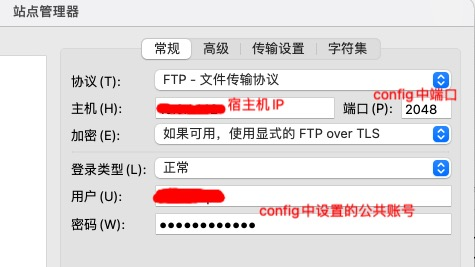
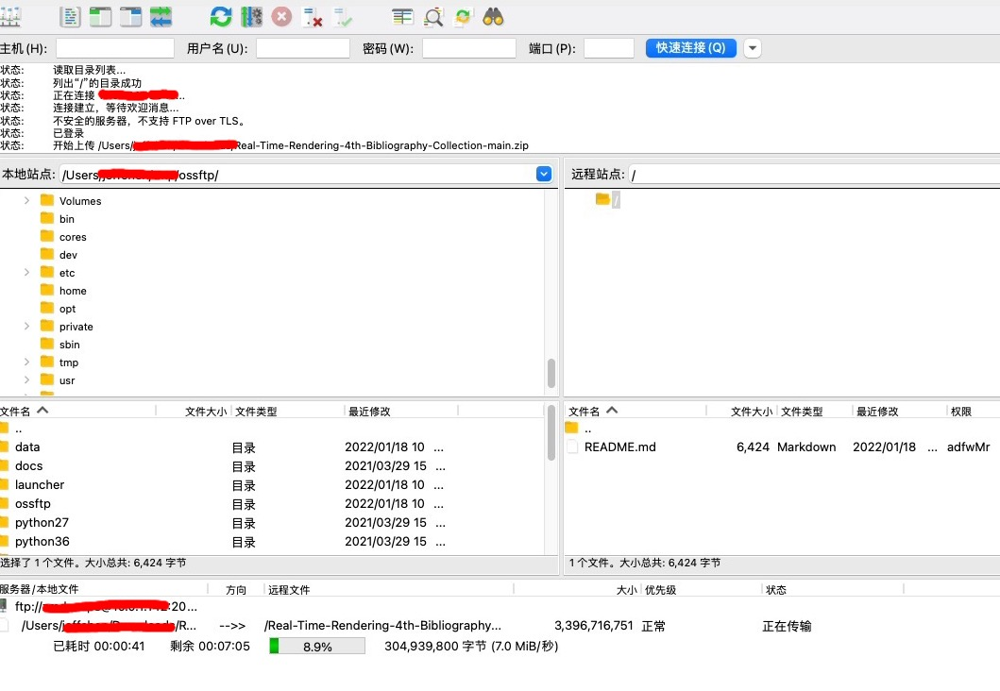
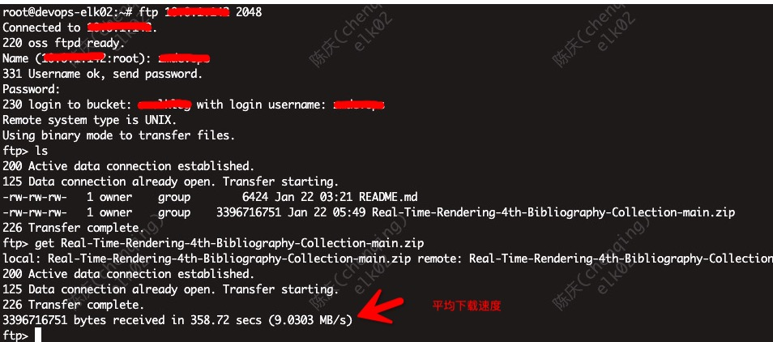

# ossftp 基于阿里云对象存储的FTP服务

## 特点

* 提供给内部用户能快速上传大文件的存储服务
* 无需频繁开通云账号
* 兼容FTP协议

## 安装

```bash
curl https://gosspublic.alicdn.com/ossftp/ossftp-1.2.0-linux-mac.zip -o ossftp.zip
unzip ossftp.zip
cd ossftp-1.2.0-linux-mac

# 可选，建议使用virtualenv

# 按实际需求修改config.json，参考 <https://help.aliyun.com/document_detail/197500.html>

# 启动
bash start.sh
```

## 使用

### 本地desktop使用FileZilla上传大文件

1. FileZilla站点设置 
2. 上传效果 

### 远程服务器使用内置ftp命令下载指定文件

1. linux主机下载 

## 注意

* 这是内部办公方案，不适合部署在公网上
* log所在路径 `ossftp安装目录/data/ossftp`

## 参考

* 官方手册 <https://help.aliyun.com/document_detail/32189.html>
* ftp命令详解 <https://zh.wikipedia.org/wiki/FTP%E5%91%BD%E4%BB%A4%E5%88%97%E8%A1%A8>