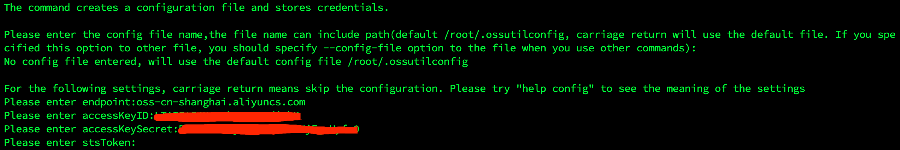

# ossutil 阿里云对象存储工具

## 安装

```bash
wget http://gosspublic.alicdn.com/ossutil/1.7.6/ossutil64
chmod 755 ossutil64
./ossutil64 config
```

生成的配置如 

## 使用

```bash
# ls
./ossutil64 ls

# 批量下载
./ossutil64 cp -r oss://your_dir . --update
```