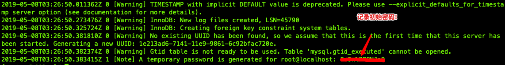

# Cloudera Distribution Hadoop（CDH）安装教程

基于6.1.1版本，小型集群（20个节点）

## 参考

* 官方手册：<https://www.cloudera.com/documentation/enterprise/6/6.1/topics/installation.html>

## 环境要求

* 硬件
  * 存储
    * `/usr` 1GB
    * `/var` > 200GB
    * `/opt` > 15GB
    * `/` > 100 GB
    * 挂载硬盘分区 < 12 * 8TB（单个DN < 100TB，单分区 < 8TB）
    * 文件格式 ext3, ext4
  * CPU > 4Core，建议 16Core以上
  * 内存 > 32GB，建议 60GB以上
* 软件
  * OS
    * CentOS 7.2~7.6; Ubuntu 16.04
    * /etc/fstab禁用atime，如`/dev/sdb1 /data1 ext4 defaults,noatime 0`
      * 重启自动挂载`mount -o remount /data1`
    * /etc/security/limits.d/20-nproc.conf放大`*    soft    nproc   655350`
    * /etc/hosts支持多域名，小写，如`192.168.1.1 cluster-01`
    * 关闭SELinux
    * 关闭防火墙，如iptables
    * /etc/sysconfig/network绑定hostname，如`HOSTNAME=cluster-01`
  * DB
    * MySQL 5.7; PostgreSQL 9.4+; Oracle 12.2
  * JDK 1.8u31+
    * 堆内存 20GB （HDFS|YARN：200主机，4000实例；HBase|Kafka：100主机，3w实例）
    * 非堆内存 12GB
  * Python 2.7
    * python-psycopg2
  * iproute-3.10

## 安装

### 主机预初始化

```bash
# yum安装
yum -y install epel-release
yum -y install vim unzip zip lrzsz tmux httpd zabbix-agent

# py安装，镜像加速
easy_install -i https://pypi.tuna.tsinghua.edu.cn/simple pip

####################
# 绑定hostname
hostname {按实际替换为内部hostname}
export hname=$(hostname)
export ip=$(ifconfig | grep inet | grep -v '127.0.0.1' | awk '{print $2}')
echo "$ip $hname" >> /etc/hosts
sed -i "s/^HOSTNAME.*$/HOSTNAME=$hname/g" /etc/sysconfig/network
echo -e "`hostname`"

# 修改/etc/hosts，加入集群相关ip和对应内部域名 略

# ulimit
# ulimit -HSn 65535
# echo "ulimit -HSn 65535" >> /etc/rc.local

# 适用centos7
sed -i "s/4096/65535/g" /etc/security/limits.d/20-nproc.conf

# 统一时区：东8区 (date -R)
# ln -sf /usr/share/zoneinfo/Asia/Shanghai /etc/localtime

# ntp时钟
echo "*/10 * * * * /usr/sbin/ntpdate -u {你的ntp服务地址} > /dev/null 2>&1" >> /var/spool/cron/root

# 安装监控
# 关闭防火墙
systemctl stop firewalld.service
systemctl disable firewalld.service
# 修改/etc/selinux/config，关闭SELinux（SELINUX=disabled）略
# yum install -y zabbix-agent
sed -i 's!Server=.*!Server={你的zabbix服务ip}!' /usr/local/zabbix/etc/zabbix_agentd.conf
sed -i 's!ServerActive=.*!ServerActive={你的zabbix服务ip}!' /usr/local/zabbix/etc/zabbix_agentd.conf
service zabbix_agentd restart
# 上zabbix平台，确认主机自动发现

# 设置swap（/proc/sys/vm/swappiness 默认60 => 10）为积极使用物理内存
echo "vm.swappiness = 10" >> /etc/sysctl.conf

# 禁用透明大页（rh6引入，管理内存是动态分配的方式，在real application clusters环境下会导致一些异常的性能问题）
echo never > /sys/kernel/mm/transparent_hugepage/defrag
echo never > /sys/kernel/mm/transparent_hugepage/enabled
# 编辑/etc/rc.d/rc.local，加入
if test -f /sys/kernel/mm/transparent_hugepage/enabled; then echo never > /sys/kernel/mm/transparent_hugepage/enabled fi
if test -f /sys/kernel/mm/transparent_hugepage/defrag; then echo never > /sys/kernel/mm/transparent_hugepage/defrag fi
# 确认/etc/rc.d/rc.local可执行
chmod +x /etc/rc.d/rc.local

# httpd开机启动
systemctl start httpd
systemctl enable httpd.service


####################
# 添加操作用户cdhtool进root组
adduser cdhtool
usermod -a -G root cdhtool
echo -e "`id cdhtool`"
# 开cdhtool免密
vim /etc/sudoers
# 最后行添加，wq!保存
cdhtool    ALL=(ALL)       NOPASSWD:ALL

# 设置目录权限
mkdir -p /opt/software
chown cdhtool:cdhtool -R /opt/software/

# datanode上，数据盘做raid0，并挂载/data

# 重启
reboot

#################### 后续安装以cdhtool为主
su - cdhtool
# 中控key复制到每个节点主机上
mkdir .ssh
echo '{你的中控公钥}' >> ~/.ssh/authorized_keys
chmod 700 ~/.ssh/
chmod 600 ~/.ssh/authorized_keys

####################
# 下载相关软件
mkdir -p /opt/software
cd /opt/software

# mysql5.7
wget https://cdn.mysql.com//Downloads/MySQL-5.7/mysql-5.7.26-linux-glibc2.12-x86_64.tar.gz

# cloudera manager
wget https://archive.cloudera.com/cm6/6.1.1/redhat7/yum/RPMS/x86_64/cloudera-manager-agent-6.1.1-853290.el7.x86_64.rpm \
https://archive.cloudera.com/cm6/6.1.1/redhat7/yum/RPMS/x86_64/cloudera-manager-server-6.1.1-853290.el7.x86_64.rpm \
https://archive.cloudera.com/cm6/6.1.1/redhat7/yum/RPMS/x86_64/cloudera-manager-daemons-6.1.1-853290.el7.x86_64.rpm
https://archive.cloudera.com/cm6/6.1.1/redhat7/yum/RPMS/x86_64/cloudera-manager-server-db-2-6.1.1-853290.el7.x86_64.rpm \
https://archive.cloudera.com/cm6/6.1.1/redhat7/yum/RPMS/x86_64/enterprise-debuginfo-6.1.1-853290.el7.x86_64.rpm \
https://archive.cloudera.com/cm6/6.1.1/redhat7/yum/RPMS/x86_64/oracle-j2sdk1.8-1.8.0+update181-1.x86_64.rpm

wget https://archive.cloudera.com/cm6/6.1.1/allkeys.asc

# cdh6
wget https://archive.cloudera.com/cdh6/6.1.1/parcels/CDH-6.1.1-1.cdh6.1.1.p0.875250-el7.parcel \
https://archive.cloudera.com/cdh6/6.1.1/parcels/CDH-6.1.1-1.cdh6.1.1.p0.875250-el7.parcel.sha256 \
https://archive.cloudera.com/cdh6/6.1.1/parcels/manifest.json

#################### 所有节点安装jdk
#  以root安装jkd8
rpm -ivh jdk-8u181-linux-x64.rpm
echo '# jdk8' >> /etc/profile && echo 'export JAVA_HOME=/usr/java/jdk1.8.0_181-amd64' >> /etc/profile && echo 'export JRE_HOME=${JAVA_HOME}/jre' >> /etc/profile && echo 'export CLASSPATH=.:${JAVA_HOME}/lib:${JRE_HOME}/lib:$CLASSPATH' >> /etc/profile && echo 'export JAVA_PATH=${JAVA_HOME}/bin:${JRE_HOME}/bin' >> /etc/profile && echo 'export PATH=$PATH:${JAVA_PATH}' >> /etc/profile && source /etc/profile

# 验证版本
javac -version

#################### namenode安装mysql
# 准备目录
mkdir -p /usr/local/mysql /data/mysql/mysql3306 /data/log/mysql/mysql3306/mysql-bin /data/log/mysql/mysql3306/tmp

touch /data/log/mysql/mysql3306/error.log
touch /data/log/mysql/mysql3306/slow.log

# 安装
tar -xzvf mysql-5.7.26-linux-glibc2.12-x86_64.tar.gz -C /usr/local/mysql --strip-components 1

tree /usr/local/mysql/ -C -L 2

# 加用户和授权
groupadd mysql
useradd -r -s /sbin/nologin -g mysql mysql -d /usr/local/mysql

chown -R mysql:mysql /usr/local/mysql /data/mysql /data/log/mysql

# 初始化库，保存密码
/usr/local/mysql/bin/mysqld --initialize --user=mysql --basedir=/usr/local/mysql --datadir=/data/mysql/mysql3306

# 如果报错，如：mysqld: error while loading shared libraries: libnuma.so.1: cannot open shared object file: No such file or directory，请安装相关组件，如下
yum install numactl
```



配置MySQL

```bash
# mysql开机启动
cp /usr/local/mysql/support-files/mysql.server /etc/init.d/mysql

# 编辑/etc/init.d/mysql，指定相关目录，如下：
basedir=/usr/local/mysql
datadir=/data/mysql/mysql3306
# end

# 编辑/etc/my.cnf，如下：
[client]
port=3306
socket=/tmp/mysql.sock

[mysql]
prompt="\\u@\\h [\\d]>"

[mysqld]
datadir=/data/mysql/mysql3306
tmpdir=/data/log/mysql/mysql3306/tmp
socket=/tmp/mysql.sock

character-set-server=utf8
# db服务集群中唯一id，备机注意修改
server-id=13306

# binlog
gtid_mode=off
enforce_gtid_consistency=off
master_info_repository=table
log_slave_updates=on
log-bin=/data/log/mysql/mysql3306/mysql-bin
log-error=/data/log/mysql/mysql3306/error.log
binlog_format=MIXED # 备库无需本行

# slow sql
slow_query_log=1
slow_query_log_file=/data/log/mysql/mysql3306/slow.log
long_query_time=0.1
lower_case_table_names=0
sql_mode=NO_ENGINE_SUBSTITUTION,STRICT_TRANS_TABLES

# 配置中出现mariadb的地方，注意对应修改
# end

# 环境变量
echo "export PATH=$PATH:/usr/local/mysql/bin" >> /etc/profile
source /etc/profile

# 自启
service mysql start
chkconfig --add mysql
chkconfig --level 345 mysql on

# 授权
mysql -hlocalhost -uroot -p # 输入初始密码
```

MySQL中操作：

```sql
-- 更新root密码
set password=password('{新root密码}');
grant all privileges on *.* to 'root'@'%' identified by '{新root密码}';
flush privileges;


```