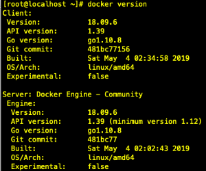

# Docker容器

## 安装

```bash
# 官方源较慢，使用国内阿里源
yum-config-manager --add-repo http://mirrors.aliyun.com/docker-ce/linux/centos/docker-ce.repo
# 安装统一版本18.09.6
yum install docker-ce-18.09.6 docker-ce-cli-18.09.6 containerd.io
# docker启动
systemctl start docker
# 配开机启动
systemctl enable docker
```



## 使用

### 限制log

```bash
docker run -d \
    --log-opt max-size=10m \
    --log-opt max-file=3 \
    image名
```

一键清理<none>镜像 ``` docker rmi -f  `docker images | grep '<none>' | awk '{print $3}'` ```

### 强制重建docker-compose中指定服务

`docker-compose up --force-recreate --no-deps service-name`