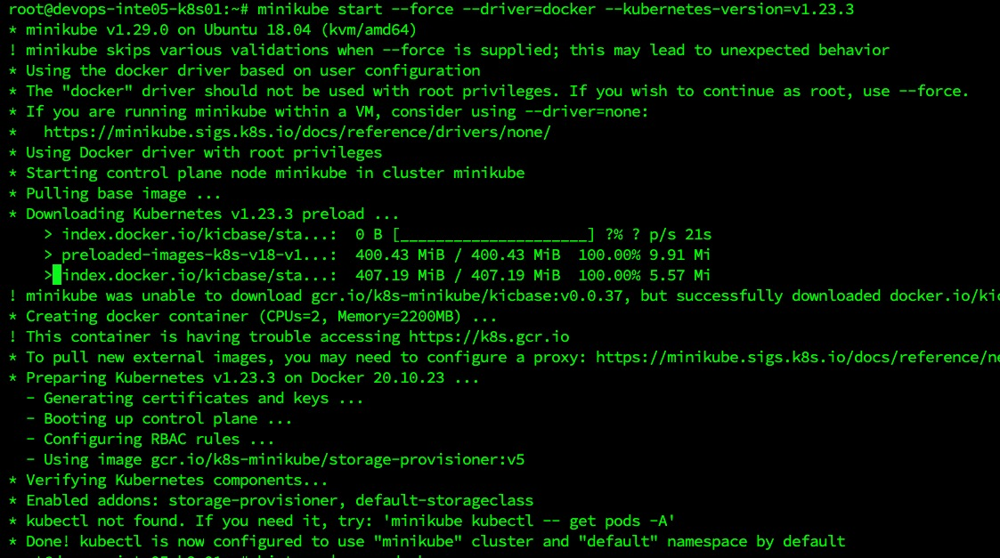
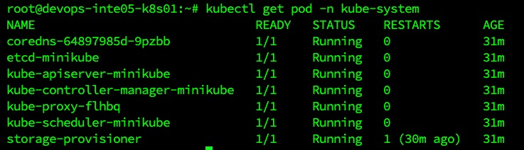
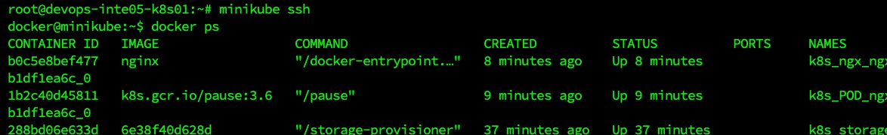

# Minikube简要教程

## 安装

Ubuntu 18 下安装 kubernetes v1.23.3（最后原生支持docker驱动的版本）

```bash
# root下执行
# 提前安装docker
apt install docker.io

# 下载官方bin安装 minikube
curl -LO https://storage.googleapis.com/minikube/releases/latest/minikube-linux-amd64
mv minikube-linux-amd64 minikube
install minikube /usr/local/bin/
# 查看版本
minikube version

# 安装 kubectl
minikube kubectl

# 安装指定版本的k8s
minikube start --force --driver=docker --kubernetes-version=v1.23.3

```



## 使用

### 提前优化

* `alias kubectl="minikube kubectl --"` 加入 `.bashrc` 后执行source
* `source <(kubectl completion bash)` 开启kubectl自动命令补全

### 常用命令

```bash
# 创建一个ngx的pod
kubectl run ngx --image=nginx:alpine
# 查看所有pod
kubectl get po -A
# 查看k8s系统pod
kubectl get pod -n kube-system

# ssh登入节点后，可以执行docker ps查看集群内容器状态
minikube ssh

# 展示可用插件
minikube addons list

# 开启dashboard，指定端口
minikube dashboard --url=true --port=8080
```




## 参考

* 官方教程 <https://minikube.sigs.k8s.io/docs/start/>
* 源码 <https://github.com/kubernetes/minikube>