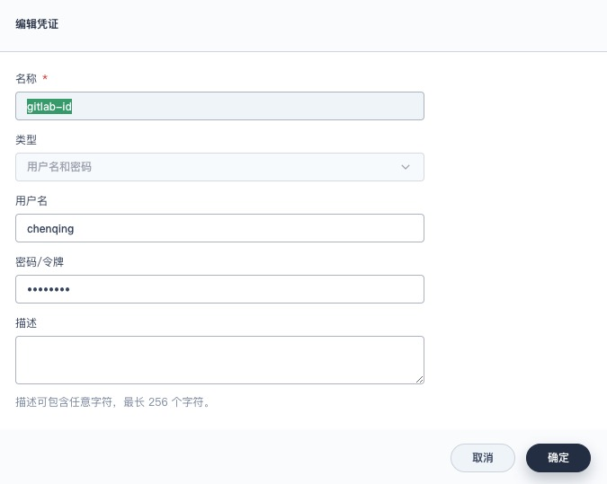
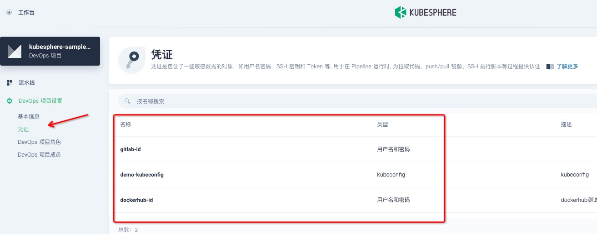
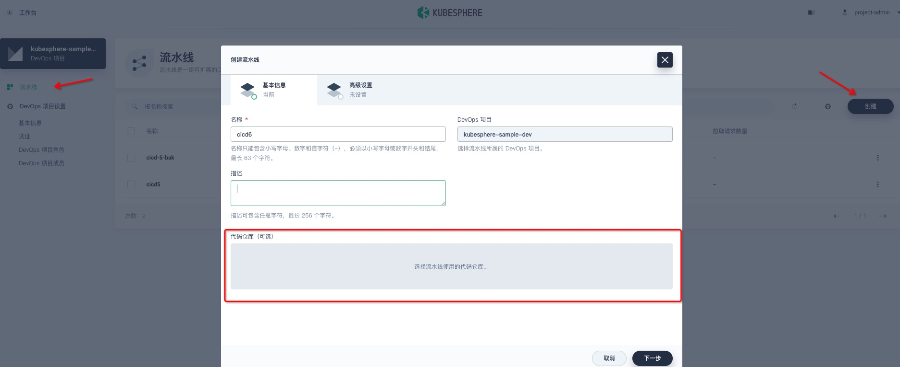
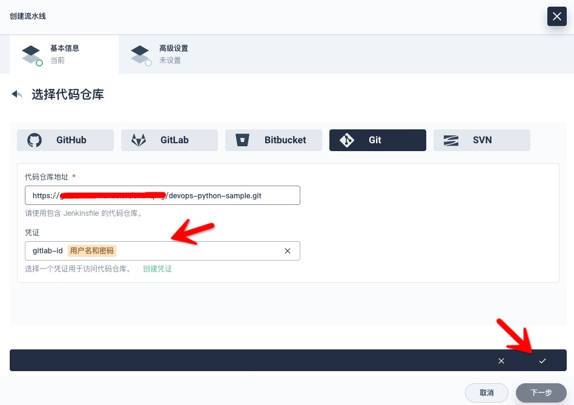
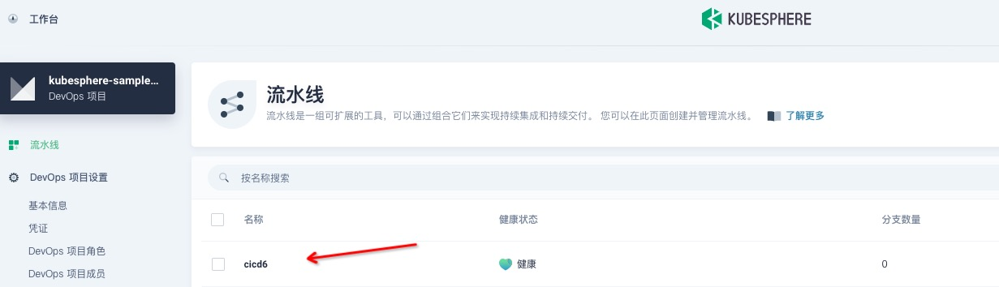
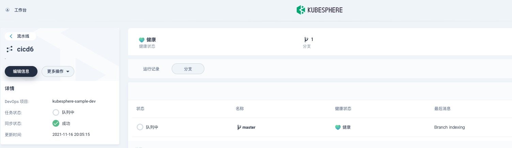
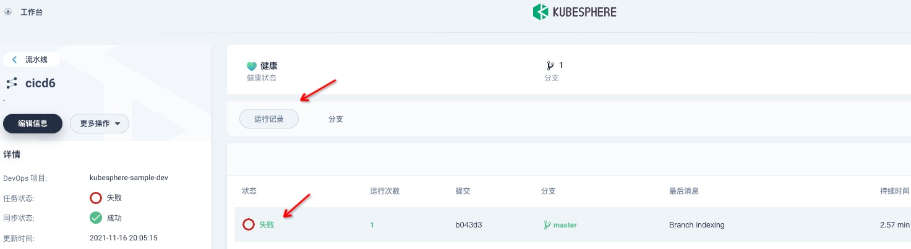

# KubeSphere 容器平台

## 安装

### linux上单节点all-in-one

基于ubuntu 18环境测试，硬件配置4C-8G-100G

1. 安装容器runtime `apt install docker.io`
2. 确认dns可用 `nslookup www.baidu.com`，反馈实际Address代表正常
3. 关闭防火墙 `ufw disable`
4. 可选：添加阿里云[容器镜像服务/镜像加速器](https://cr.console.aliyun.com/cn-hangzhou/instances/mirrors)
5. 安装依赖组件
   1. `apt install socat`
   2. `apt install conntrack`
   3. `apt install ipset -y`
6. 指定环境参数`export KKZONE=cn`，下载kk`curl -sfL https://get-kk.kubesphere.io | VERSION=v1.2.0 sh -`
7. `chmod +x kk`后执行安装`./kk create cluster --with-kubernetes v1.21.5 --with-kubesphere v3.2.0` {: style="width:60%"}，{: style="width:60%"}
8. 安装验证`kubectl logs -n kubesphere-system $(kubectl get pod -n kubesphere-system -l app=ks-install -o jsonpath='{.items[0].metadata.name}') -f`，{: style="width:60%"}
9. 第一次登入会要求改admin密码
10. admin访问管理界面，{: style="width:60%"}

### 启用插件

#### DevOps系统

1. 以`admin`用户访问`平台管理-集群管理-CRD`页面，搜索`clusterconfiguration` {: style="width:60%"}
2. 进入详情页，`编辑 YAML` {: style="width:60%"}
3. 改`spec.devops.enabled`为true，并确定保存
4. 等待几分钟，集群组件会重启，验证安装结果 `kubectl get pod -n kubesphere-devops-system` {: style="width:60%"} {: style="width:60%"}

#### Istio服务网格

[TODO]

## 使用

### 创建企业空间、项目、用户和角色

#### 创建用户

1. `平台管理-访问控制-用户`，`创建`新用户管理员 {: style="width:60%"}
2. 依次新增用户`企业空间管理员(ws-manager)`、`普通项目用户(project-regular)`等

#### 创建企业空间

1. 以`ws-manager`身份登录，进入`企业空间`，`创建`新空间`demo-workspace`，指定普通用户`ws-admin`为该空间管理员
2. 以`ws-admin`登入，邀请普通用户`project-admin`和`project-regular`进入该空间，并授权 {: style="width:60%"}

#### 创建项目（等同NameSpace）

1. 以`project-admin`登入，进入`项目`，点`创建`新项目`demo-project` {: style="width:60%"}
2. 点击进入项目详情，设置资源限制 {: style="width:60%"}
   1. 注意 1Gi == 1024MiB; 1G == 1000MB
3. 邀请已有用户为项目成员
4. 在`网关设置`创建`NodePort`模式的网关，供外部访问 {: style="width:60%"}

### 项目部署

以简单的`dockerbogo/docker-nginx-hello-world`为例

1. 创建应用：`应用负载-应用-自制应用`中创建新应用`nginx-hello-world` {: style="width:60%"}，{: style="width:60%"}
   1. 下一步创建`无状态服务`{: style="width:60%"}，{: style="width:60%"}，{: style="width:60%"}
   2. 向导`容器镜像`中，点击`添加容器镜像`，搜索`dockerbogo/docker-nginx-hello-world`，点`使用默认端口` {: style="width:60%"}
   4. 注意：资源需要限制，不能大于项目自身配额 {: style="width:60%"}
   5. 下一步`添加存储卷`忽略
   6. 在`高级设置`右下方点`创建`，完成向导
   7. 最后点击`下一步` {: style="width:60%"}
   8. `路由设置`中，点击`创建`，使用默认规则
2. `工作负载`页下验证服务 {: style="width:60%"}
3. 通过 NodePort 访问 {: style="width:60%"}
   1. 选择 {: style="width:60%"}，并`确定`
   2. 进入服务详情页，可以看见暴露的端口 {: style="width:60%"}
4. 访问效果 {: style="width:60%"}

### DevOps管理(CI/CD)

前提:

* 已有用户`project-admin`，具有`admin`或`operator`角色 {: style="width:60%"}

#### 凭证管理

* 添加git账号`gitlab-id`，用于读源码repo {: style="width:60%"}
* 类似上文，添加docker镜像库账号`dockerhub-id`，用于推送镜像
* 添加kubeconfig类账号`demo-kubeconfig`，用于部署资源 {: style="width:60%"}
* 以上账号要用于应用repo根目录的`Jenkinsfile` {: style="width:60%"}

#### 建立流水线

1. 进`流水线`点`创建`，输入自定义名称后，选择代码仓库 {: style="width:60%"}
2. 选`Git`，填入应用所在git地址，并选择之前创建的git账号凭证，点勾保存 {: style="width:60%"}
3. （可选）点`下一步`，在`高级设置`中配置`正则过滤`、`Webhook`和`定时扫描`等 {: style="width:60%"}
4. 点`创建`完成向导 {: style="width:60%"}
5. 进入流水线详情页的`分支`，扫描仓库，如果git账号正确的话，会读取符合正则过滤条件的分支信息，自动开始第一次构建（多半以失败告终）  {: style="width:60%"}
6. 进入流水线详情页的`运行记录`，点击记录进入详情页  {: style="width:60%"} 
7. 可以点`查看日志`定位问题  {: style="width:60%"} 
8. 不断调整，直到流水线正常运行。

## 踩坑记录

* 尽量不要跑有状态的服务，非常危险：有时候db类应用一旦挂了，数据很难恢复一致；另外v3.2.0的前端js有bug，有状态的服务详情页报错
* v3.2.0对应的k8s默认api升级，导致相关部署插件过期不可用，参考`https://github.com/kubesphere/website/issues/2096`

## 参考

* 中文官网 <https://kubesphere.com.cn/>