# Jenkins实用手册

* 版本 2.238
* 在Ubuntu 18 上测试通过

## 安装

```bash
# 设定Jenkins工作目录
mkdir -p /data/jenkins

# docker启动
docker run \
	--name=go_jenkins \
	--user=root \
	--volume=/data/jenkins:/var/jenkins_home \
	-p 8080:8080 \
	--restart=always \
	-d jenkins/jenkins:2.238

# 显示安装用的admin密码
cat /data/jenkins/secrets/initialAdminPassword
```

1. 访问`http://主机IP:8080/`开始安装向导 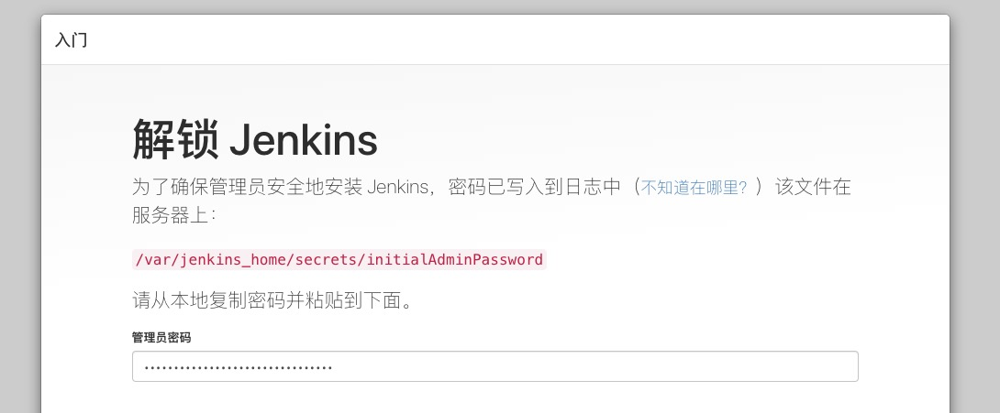
2. 选择安装推荐插件，下一步大概会碰到各种失败 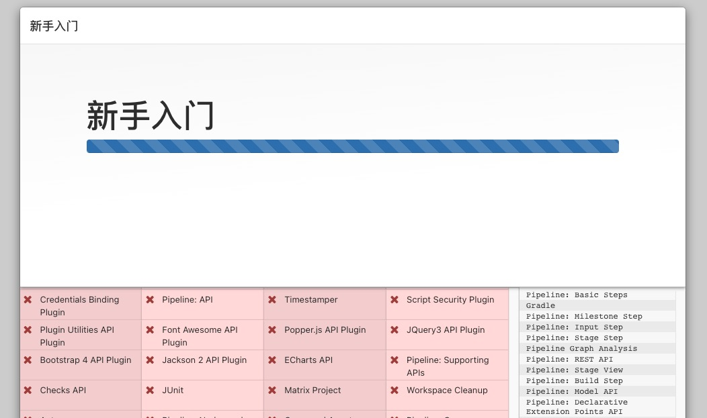
3. 更新国内安装源，访问 `http://主机IP:8080/pluginManager/advanced` 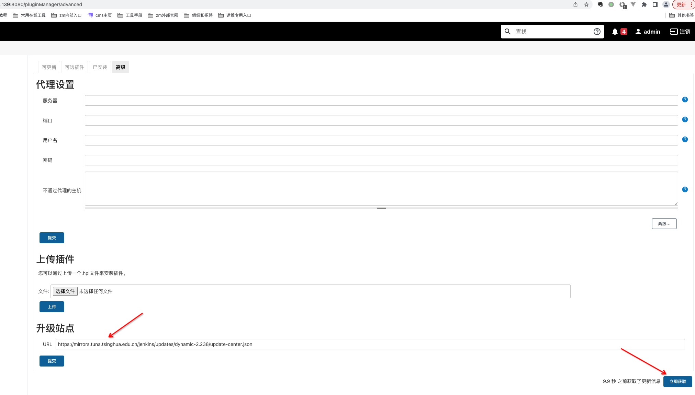
   1. 良心国内开源镜像，清华：<https://mirrors.tuna.tsinghua.edu.cn/jenkins/>
4. 配置第一个用户
5. 配置实例的域名 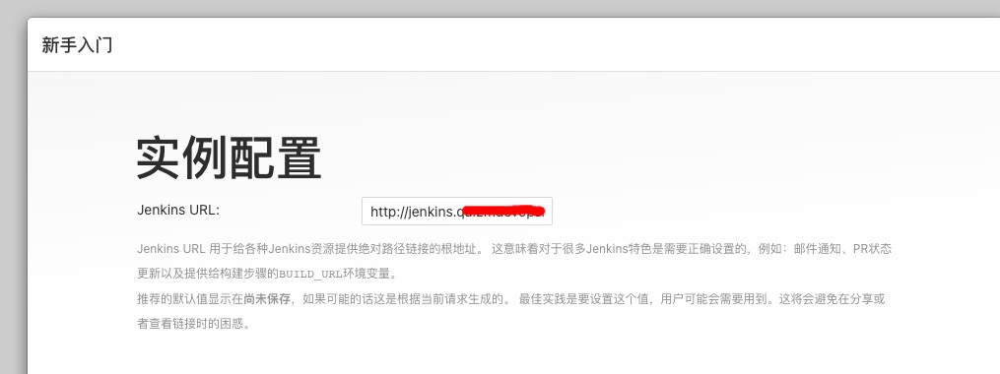
6. 启动服务 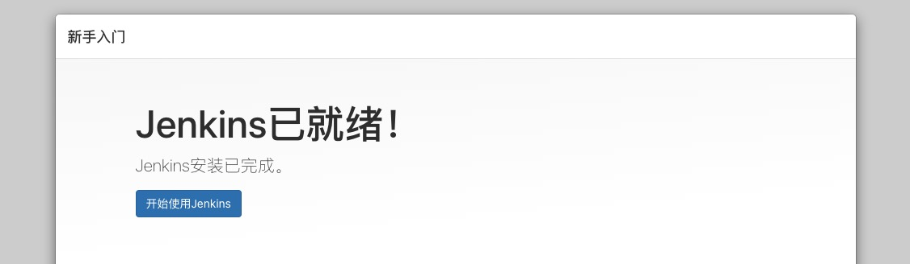

## 使用

### 安装插件

常用插件： 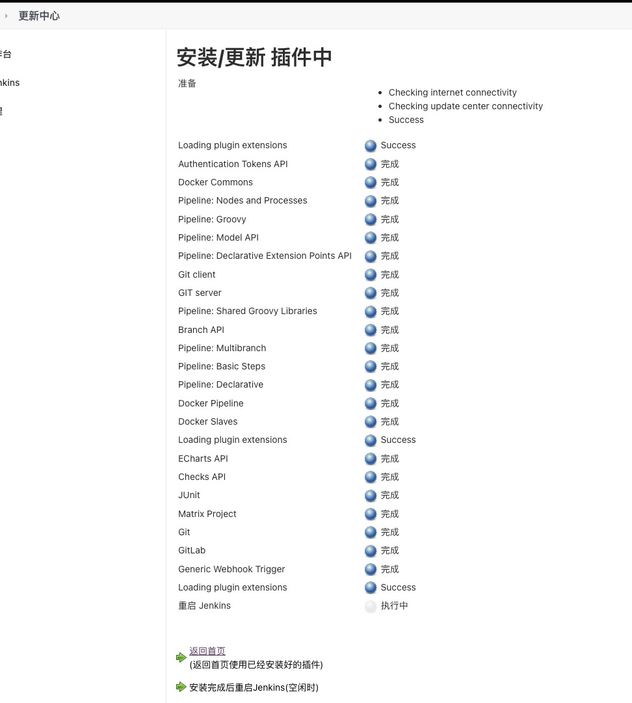

* pipeline相关:
  * Pipeline: Nodes and Processes
  * Pipeline: Groovy
  * Pipeline: Model API
  * Pipeline: Declarative Extension Points API
  * Pipeline: Shared Groovy Libraries
* docker相关: 
  * Docker Commons
  * Docker Pipeline
  * Docker Slaves
* git相关:
  * Git
  * Git Parameter
  * GitLab
  * Gitlab Authentication
  * Gitlab API
* webhook相关:
  * Generic Webhook Trigger

### 集成gitlab

1. 在`Jenkins -> 系统配置`的'Gitlab'下配置内部gitlab服务地址 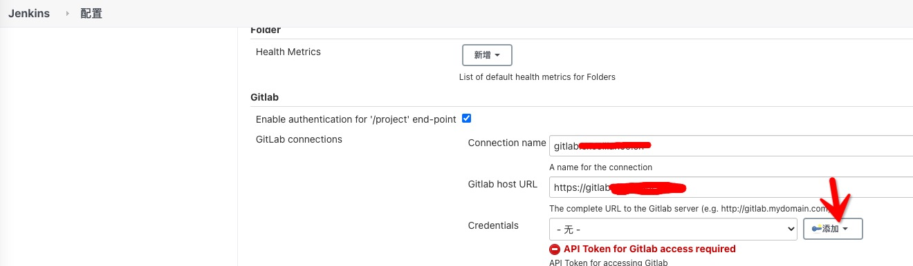
2. 在'凭据'里添加gitlab的token 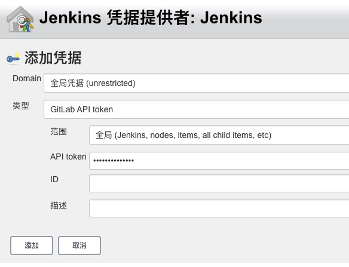
   1. 在gitlab的 `用户设置 -> 访问令牌`里生成token 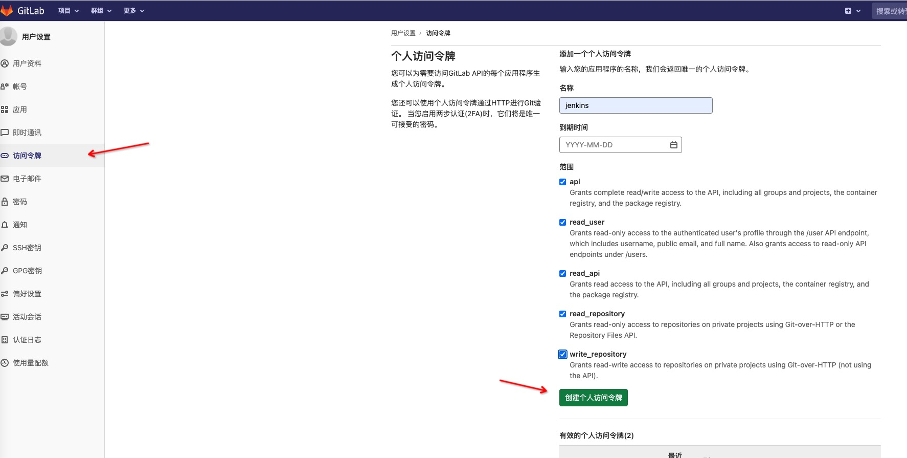
3. 连接测试后保存 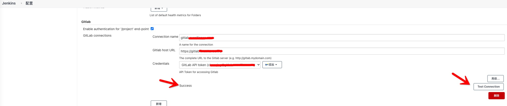
   1. 由于墙的原因，建议在jenkins实例里提前安装go

### 安装go编译环境

1. `管理Jenkins -> 插件管理`里安装'Go plugin'
2. `管理Jenkins -> 全局工具配置`里'新增 Go' 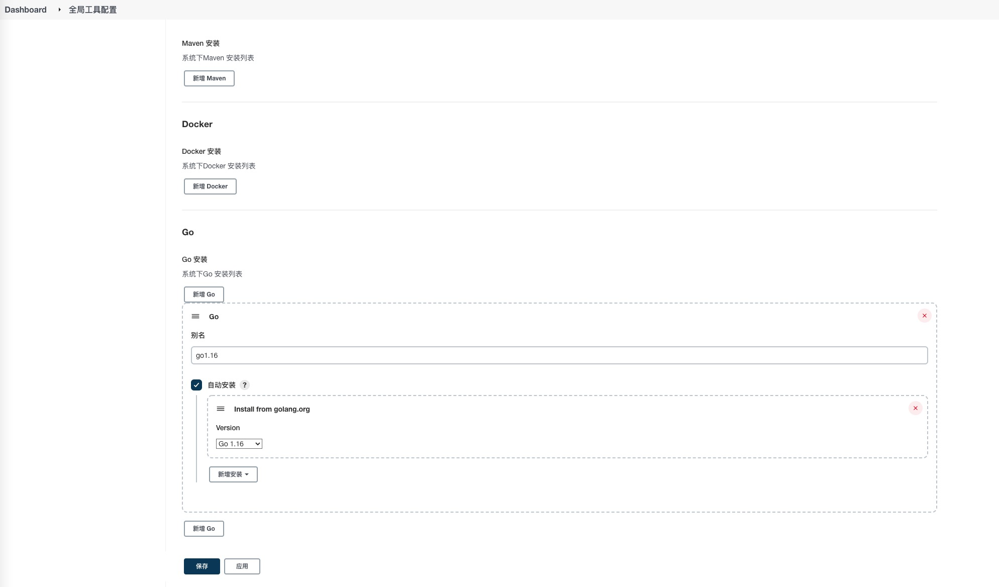

### pipeline

1. 进入`新建Item`，输入新任务名，选择`多分支流水线`后，确定
2. 在`分支源`中添加git仓库，输入远程git地址
3. 

### 定时任务

### 集成docker

## 参考

* 官网文档 <https://www.jenkins.io/zh/doc/>