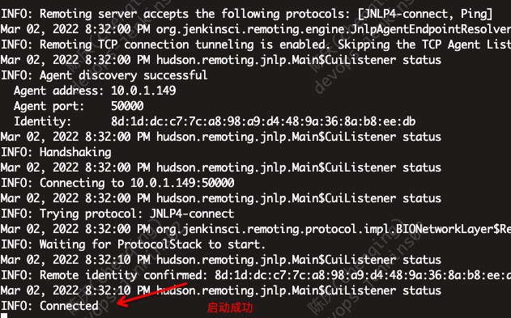

# Jenkins实用手册

* 版本 2.336
* 在Ubuntu 18 上测试通过

## 安装

```bash
# 设定Jenkins工作目录
mkdir -p /data/jenkins

# docker启动
docker run \
	--name=go_jenkins \
	--user=root \
	-v /data/jenkins:/var/jenkins_home \
    -v /etc/localtime:/etc/localtime \
	-p 8080:8080 \
	--restart=always \
	-d jenkins/jenkins:2.336

# 显示安装用的admin密码
cat /data/jenkins/secrets/initialAdminPassword
```

1. 访问`http://主机IP:8080/`开始安装向导 
2. 选择安装推荐插件，下一步大概会碰到各种失败 
3. 更新国内安装源，访问 `http://主机IP:8080/pluginManager/advanced` 
   1. 良心国内开源镜像，清华：<https://mirrors.tuna.tsinghua.edu.cn/jenkins/>
4. 配置第一个用户
5. 配置实例的域名 
6. 启动服务 

## 使用

### 安装插件

常用插件： 

* pipeline相关:
  * Pipeline: Nodes and Processes
  * Pipeline: Groovy
  * Pipeline: Model API
  * Pipeline: Declarative Extension Points API
  * Pipeline: Shared Groovy Libraries
* docker相关: 
  * Docker Commons
  * Docker Pipeline
  * Docker Slaves
* git相关:
  * Git
  * Git Parameter
  * GitLab
  * Gitlab Authentication
  * Gitlab API
* webhook相关:
  * Generic Webhook Trigger
* 传包
  * Publish Over SSH
* 备份
  * ThinBackup

### 集成gitlab

1. 在`Jenkins -> 系统配置`的'Gitlab'下配置内部gitlab服务地址 
2. 在'凭据'里添加gitlab的token 
   1. 在gitlab的 `用户设置 -> 访问令牌`里生成token 
3. 连接测试后保存 
   1. 由于墙的原因，建议在jenkins实例里提前安装go

### 配置ssh推送服务

1. 在jenkins实例中生成ssh-key
2. 公钥加入包库所在主机指定用户（建议非root）的`authorized_keys`
3. 在`Jenkins -> 系统配置`下配置`Publish over SSH` 
4. 在pipeline中的使用 

### 配置邮件发送

以阿里云邮件服务为例

* 在`系统配置 -> 邮件通知`配置 
* 注意：阿里云邮件服务要求填`Mail From`，在插件中是找不到地方配置的，实际使用的当前用户的邮件地址 

### 安装go编译环境

1. `管理Jenkins -> 插件管理`里安装'Go plugin'
2. `管理Jenkins -> 全局工具配置`里'新增 Go' 

### pipeline

1. 进入`新建Item`，输入新任务名，选择`流水线`后，确定
2. 在`流水线`脚本中写相关code

```js
// 以某个go应用编译为例
pipeline {
    agent any
    
    tools {
        // env setup，在全局设置中的go环境名
        go 'go1.16'
    }

    environment {
        // 当前ws用环境变量
        GOPATH = "${JENKINS_HOME}/jobs/${JOB_NAME}/builds/${BUILD_ID}"
    }
    
    stages {
        stage('Clone') {
            steps {
                echo '1.Clone Stage'
                git credentialsId: 'chenqing', url: 'https://gitlab.xxx.com/my-group/go-api.git'
                // 显示提交的最后2条git记录
                sh 'git log -2'
                script {
                    // get last commit hash
        			build_commit = sh (script: 'git rev-parse --short HEAD', returnStdout: true).trim()
        		}  
            }
        }
        stage('Build') {
            steps {
                echo "2.Build Stage"
                // 执行编译动作，根据实际生成
                sh 'make build'
            }
        }
        stage('Make Tar') {
            steps {
                echo "3.Make Tar Stage"
                // go-api是编译完成果，计算md5，并打包
                sh 'md5sum go-api > go-api.md5'
                sh 'tar -cPf ${JOB_NAME}_${BUILD_NUMBER}.tar go-api go-api.md5'
            }
        }
        stage('cp to package repo') {
            steps {
                echo "4.cp to package repo"
                // package.com是包库的ssh地址，按应用名分目录存储
                sh 'ssh root@package.com mkdir -p /mnt/package/repo/${JOB_NAME}'
                sh 'scp ${JOB_NAME}_${BUILD_NUMBER}.tar root@package.com:/mnt/package/repo/${JOB_NAME}/${JOB_NAME}_${BUILD_NUMBER}.tar'
            }
        }
        stage('Clear Workspace') {
            steps {
                echo '9.Clear Workspace'
                cleanWs()
            }
        }
    }
    post {
        always {
            // 邮件通知结果
            emailext body: "${currentBuild.currentResult}: Job ${env.JOB_NAME} build ${env.BUILD_NUMBER}\n More info at: ${env.BUILD_URL}",
                to: "admin@163.cn",
                subject: "Jenkins Build ${currentBuild.currentResult}: Job ${env.JOB_NAME}"
            
        }
    }
}
```

### 第三方通过API调用

1. 在当前用户的设置页面，添加API Token 
2. 通过Post发送请求 `curl --location --request POST 'http://{用户名}:{上文生成的Token}@{jenkins域名或IP:Port}/job/{唯一项目名}/build'`
3. 注意：`Error 403: No valid crumb was included in the request`的解决方案和Jenkins版本有关，我的方案在v2.336上测试通过

### 定时任务

### 集成docker

### 数据迁移

其实核心是备份`jenkins_home`，也可使用插件`ThinBackup`

1. `ThinBackup`设置 
2. 将导出的备份目录，复制解压到目标jenkins的`jenkins_home`下 
3. 重启Jenkins，注意尽量保持版本一直，否则load任务和plugin可能会失败

### 扩展slave节点

1. `管理Jenkins -> 节点管理`中'新建节点'
2. 配置相关信息，并保存 
3. `节点列表`中点击刚才新建的节点，确认启动命令和下载jar包 
4. 在slave主机上安装java，如 `apt install default-jre`
5. 上传jar，并使用上文的命令启动 
6. 访问`节点列表`，确认节点接入 
7. 可选：slave上使用supervisor开机启动jar
8. 注意：
   1. master上依赖的环境在slave上要部署在同目录，如go，ssh-key等
   2. 建议agent.jar放在用户目录下，因为需要读sh环境变量（.bashrc）

## 参考

* 官网文档 <https://www.jenkins.io/zh/doc/>