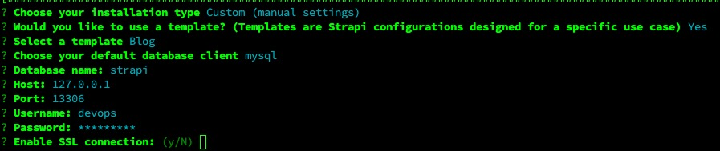
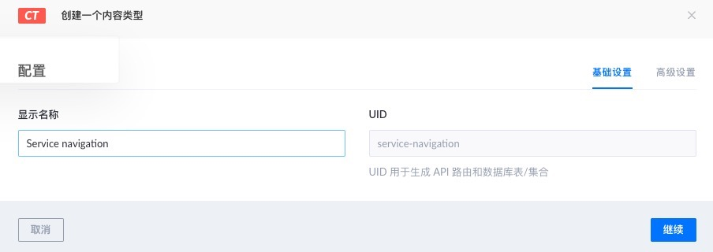
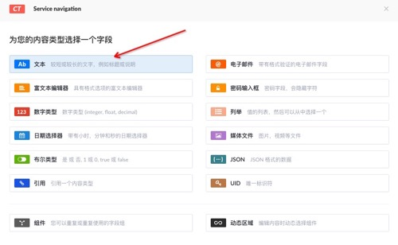
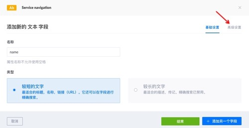
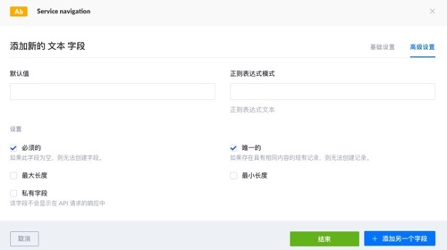
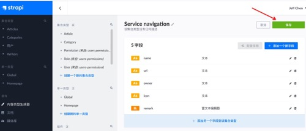
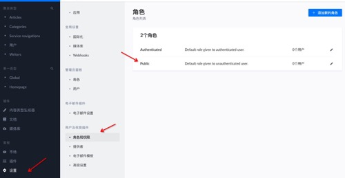
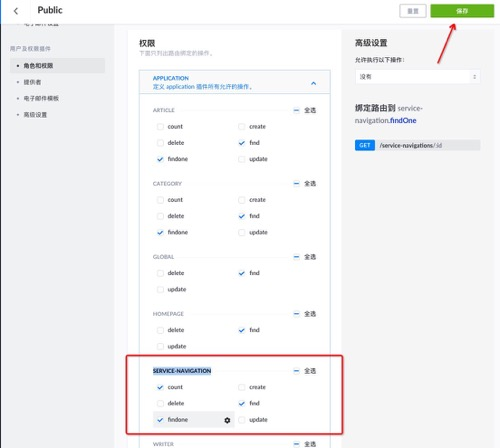

# 无头CMS - Strapi

## 安装

* [mysql参考](../../tech_tutorial/DB/mysql.md)，提前新建`strapi`库

### 基于docke-compose

* TODO 第二次安装失败，启动报js错，待fix

```yaml
version: '3'
services:
  strapi:
    image: strapi/strapi:3.6.8-node14
    environment:
      DATABASE_CLIENT: mysql
      DATABASE_HOST: 0.0.0.0
      DATABASE_PORT: 13306
      DATABASE_NAME: strapi
      DATABASE_USERNAME: devops
      DATABASE_PASSWORD: devops123
      DATABASE_SSL: 'false'
    volumes:
      - ./app:/srv/app
    ports:
      - '1337:1337'
```

### 基于源码

1. 安装nodejs14
```bash
curl -sL https://deb.nodesource.com/setup_14.x | sudo -E bash -  
apt-get install -y nodejs
```
2. 安装yarn `npm install -g yarn`
3. cd进自己的项目目录，安装依赖 `yarn install`，注意如果存在`yarn.lock`，需要先delete它，否则会报```Error: `make` failed with exit code: 2```
4. 安装db驱动`npm install mysql --save`
5. 新建cms项目 `yarn create strapi-app your-cms`
6. 一堆的配置选择 
7. 检查mysql数据源 `./config/database.js`
```js
module.exports = ({ env }) => ({
  defaultConnection: 'default',
  connections: {
    default: {
      connector: 'bookshelf',
      settings: {
        client: 'mysql',
        host: env('DATABASE_HOST', '0.0.0.0'),
        port: env.int('DATABASE_PORT', 13306),
        database: env('DATABASE_NAME', 'strapi'),
        username: env('DATABASE_USERNAME', 'devops'),
        password: env('DATABASE_PASSWORD', 'devops123'),
      },
      options: {},
    },
  },
});
```
5. 运行web服务 `yarn develop`
6. 访问admin页面 <http://localhost:1337/admin>

### 常用插件

* DOCUMENTATION SwaggerUI可视化的API

## 使用

### 建模

以构建`服务导航（Service navigation）`为例

1. 在`内容类型生成器（content-type-builder）`页，点击`集合类型`下的`创建一个新的集合类型`
2. `基础设置`下填入名称，点击`继续` 
3. 选择字段类型`文本` 
4. 字段详细页中填入属性名`name`，选`较短的文字`，点击`高级设置` 
5. 根据实际情况，勾选`必须的、唯一的`，在点击`添加另一个字段`，重复上述步骤，直到建模完成，点击`结束` 
6. 最后`保存`模型 

### 授权

1. 进`设置`菜单，点击选择`角色和权限`下的`public` 
2. 在`Public`详情页中`权限`下的`APPLICATION`列表中，勾选之前建模的`SERVICE-NAVIGATION`的相关权限，最后点`保存` 

### API访问

如果安装了`documentation插件`，提供默认的swagger的地址`http://localhost:1337/documentation/`

## 参考

* 官网 <https://strapi.io/>
* 中文手册 <https://getstrapi.cn/developer-docs/latest/getting-started/introduction.html>