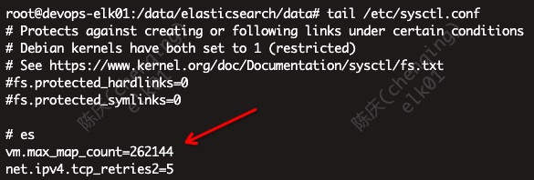

# docker-comepose版的ELK

## 需求

* docker-compose的安装
* es存储独立
* 可集群扩展
* 关闭收费部分

## 安装

### 安装前提

* 建议内存2G以上，data存储100G（独立挂载在/data）以上，并777授权
* docker和compose版本符合要求
* root权限
* OS配置优化：
  * `ulimit -n 65535` 文件句柄调大，因为es会有大量碎片文件IO
  * `swapoff -a` 禁用swap，防止磁盘IO降低es性能
  * `sysctl -w vm.max_map_count=262144` 调大虚拟地址空间
  * `sysctl -w net.ipv4.tcp_retries2=5` 降低TCP重传次数，以提高es发现故障节点的处理速度

### 安装

```bash
cd /opt
git clone https://github.com/deviantony/docker-elk.git
cd docker-elk
docker-compose up -d
```

* （可选）关闭收费：修改`docker-elk/elasticsearch/config/elasticsearch.yml`里的`xpack.license.self_generated.type`为`basic`
* 访问 <http://localhost:5601> 进入Kibana，默认账号`elastic/changeme`
* 访问es的http api `curl http://localhost:9200 -u elastic:{yml文件中的密码}`
* 卸载并清理数据 `docker-compose down -v`

### 配置

* 修改默认密码
  * es密码 `docker-compose.yml`的`ELASTIC_PASSWORD`
  * kibana对接es `kibana/config/kibana.yml`的`elasticsearch.password`
  * logstash的监控采集 `logstash/config/logstash.yml`的`xpack.monitoring.elasticsearch.password`
* 增加JVM内存，修改`docker-compose.yml`
  * es `ES_JAVA_OPTS: "-Xmx2g -Xms2g"`
  * logstash `LS_JAVA_OPTS: "-Xmx1g -Xms1g"`

## 参考

* 原版配置 https://github.com/deviantony/docker-elk