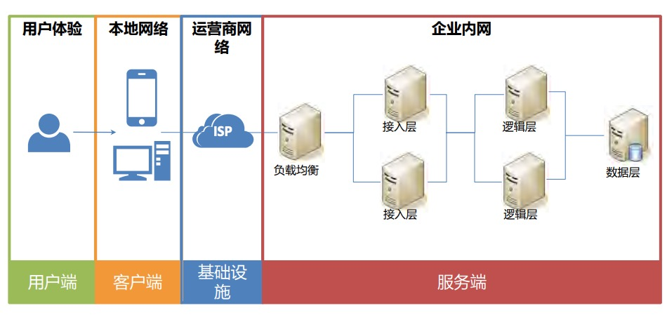
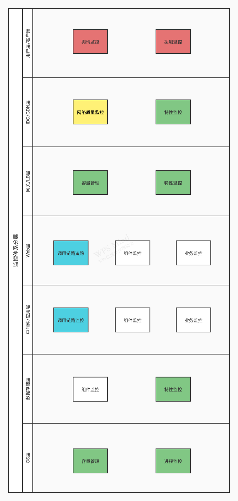

# 监控告警体系

<!-- toc -->

## 目的

1. 监控告警体系相关定义、架构和评价标准
2. 介绍一种实现方案

## 常用定义

* 监控服务：对运行的服务（对象）实施数据采集和存储、处理分析和异常识别、事件通知、可视化，用于保障SLA，是运维的最基础和重要的工作之一。
* 事件管理流程：事件是对计划外的、会引起服务质量下降的事态，事件管理流程是要求快速响应事件、及时恢复服务质量、降低用户投诉的全生命周期管理。
* 紧急变更：收到突发事件时，为了满足业务需要而实施的变更，常用于运维的故障处理。
* 故障处理流程：在服务出现异常时，运维快速发现和解决问题的流程，包括：故障发现、故障追踪、故障修复、事后小结复盘。
* 服务连续性：遇到重大故障时，能快速恢复服务的能力，如：业务恢复计划、数据备份、容灾、混沌工程等。
* 业务高可用：通过业务分析等调查方式，找出业务的高可用的需求，搭建度量指标体系，识别风险，建立对应的服务架构和组织。
* 用户体验优化：基于监控体系的数据采集能力，量化用户的体验指标，用于异常的发现、定位和修复。
* 应用性能管理：对应用|组件|模块的性能指标进行度量、采集、可视化，用于业务链路的性能问题追溯、修复，和高可用架构设计。

## 架构

### 数据采集的模式

1. 被动模式：通过部署探针，从应用外部获取服务的指标。
2. 主动模式：应用中加入埋点，主动上报。
3. 旁路模式：与应用无关，通过对网络层的`端口镜像`实现，不影响业务的网络。

### 业务链路

### 监控对象的分类分层

基础监控（绿色），容易采集而信息密度低，后期被聚合

   1. 容量监控：主机的磁盘容量、HTTP服务的QPS
   2. 进程监控：主机的进程信息
   3. 特性监控：针对不同的监控目标特性而制定的指标采集
   
服务端监控

   1. 调用链路追踪（蓝色）：应用之间的调用关系和时序体现
   2. 组件监控：对常用的开源组件（如：MySQL、Redis、Nginx、MQ）的指标监控
   3. 业务监控：自研应用的监控，重点在Log采集和分析

网络质量监控（黄色）：独立采集系统，部署多点，结合GIS

用户体验监控（红色），最直观、重要的顶层业务质量体现

   1. 舆情监控：用户对业务的投诉和反馈纳入工单，定期统计和优先解决
   2. 拨测监控：Mock用户定期对业务外部接口访问，获取服务可用性、相应时长、状态反馈码等核心指标

## 评价指标和标准

### 成熟度等级

1. 初始级：靠人肉监控和排障、灾备缺失，运维疲于救火。
2. 基础级：有部分监控采集工具、通过数据分析能触发告警，及时通知运维。
3. 成熟级：端到端的全链路感知，通过可视化的数据平台，对问题点进行分析和定位，在用户投诉之前发现并解决业务隐患。
4. 优化级：对服务质量进一步优化提高，保障稳定性，支持业务的动态变化的自动化处理。

### 采集体系

### 告警规则

告警规则 = 查询条件+触发条件+事件定义

* 查询条件：指定采集指标，和过滤约束条件，如：时间范围、主机范围指定，支持多重条件复合
* 触发条件：选择计算的范式，与阈值对比
  * 计算的范式：一种计算的表达式|宏定义，可以用模板包装
  * 阈值：预先定义好的，用于对比的值|对象，分静态和动态
* 事件定义：触发后的事件等级、发送的报文格式等，推送给指定的通知服务

### 通知服务

事件一览 + 告警事件的通知渠道 + 事件处理和升级流程 + Hook机制

* 事件一览：所有收到的事件，按照条件显示
* 通知渠道：多种外部通知方式，如：邮件、微信通知接口、电话
* 事件处理和升级流程：
  * 事件处理：
    * 信息补全：服务从事件报文中抽取关键key，通过查询CMDB，进一步补全事件完整信息，如：该事件属于哪个APP（BU）、负责人是谁、上下游服务是谁、同类告警的处理提示，可以不断完善
    * 告警收敛：
      * 事件聚合：同类事件合并为1个告警
      * 事件静默：已经发送过的告警，同类新事件在指定一段时期内不再发送告警
    * 告警确认：
      * 用户处理：运维或其他负责人，通过界面或接口，确认处理某个告警，然后关闭该告警
      * 自动关闭：没有持续收到同类事件、或者收到恢复事件，将对应的告警自动关闭
  * 事件升级：同类事件聚合形成告警，告警一直未被处理，一段时间后通知该服务的上级负责人，事件严重等级可能会提升
* Hook机制：可选，用于组建自动处理pipeline，如某个APP死机后，通过hook，传入APP的key，自动调用APP重启接口

### 可视化

[TODO]

## 元模型

### 采集指标库

| 字段名 | 类型 | 范式 | 备注 |
| ---- | ---- | ---- | ---- |
| name | String | 唯一 | 指标唯一名 |
| cname | String |  | 中文名 |
| meaning | String | 必填 | 指标含义 |
| calc_formula | String |  | 采集计算公式 |
| rel_unit | 字典 |  | 数据单位，从字典：单位 中选择 |
| rel_level | 字典 | 必填 | 所属层级，从字典：层级 中选择 |
| rel_type | 字典 | 必填 | 采集类型，从 Metric、Log、APM 中选择 |
| namespace | String | 默认default | 命名空间 |

对不同的采集类型，实现的方式是

### 告警规则库

| 字段名 | 类型 | 范式 | 备注 |
| ---- | ---- | ---- | ---- |
| name | String | 唯一 | 指标唯一名 |
