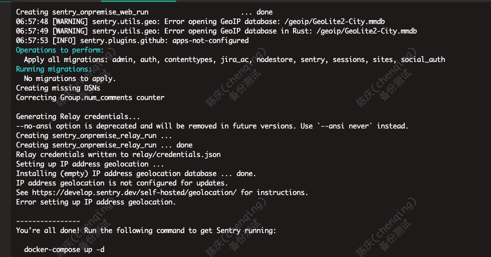
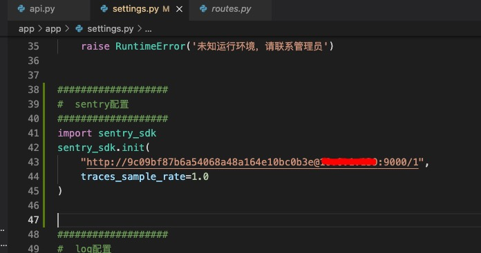
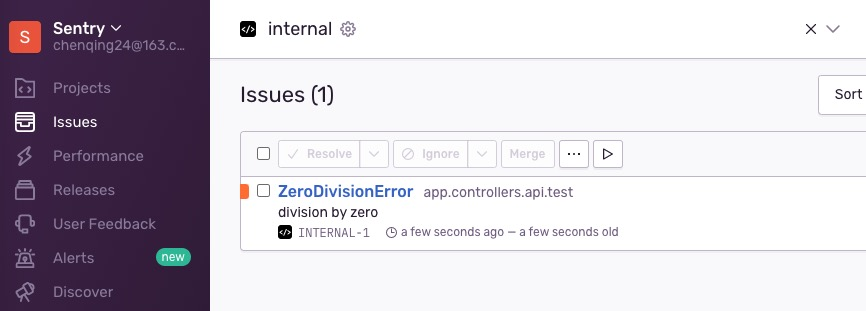
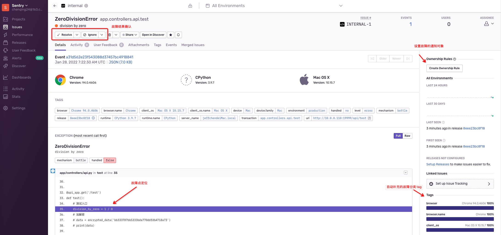

# Sentry 故障追溯平台

## 本地安装

```bash
# 一键安装
git clone https://github.com/getsentry/self-hosted.git
mv self-hosted/ sentry
cd sentry/
./install.sh

# 安装期间，会互动创建管理员账户密码

# 启动
docker-compose up -d
```



* 访问`http://宿主机IP:9000/`，初始化相关配置，如邮件发送

### app接入

以py为例

1. 在工程项目下 `pip install --upgrade sentry-sdk`
2. 在文件启动部分，加载sdk，配置DSN和采集率 
3. 测试故障上报  

## 参考

* 官网 <https://sentry.io/>