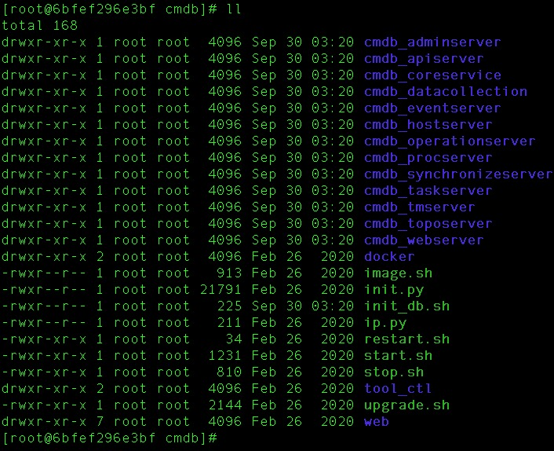
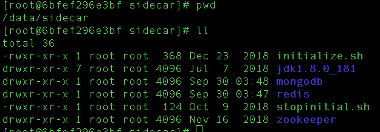

# 蓝鲸智云配置平台(BlueKing CMDB)

## 安装

### 目录和架构



* Web展示层 `cmdb_webserver`
* API网关层 `cmdb_apiserver`
* 服务层
  * 原子业务层
    * `cmdb_adminserver` 配置刷新、初始化数据写入等
    * `cmdb_eventserver` 事件订阅与推送
    * `cmdb_procserver` 系统进程
    * `cmdb_toposerver` 拓扑模型
    * `cmdb_hostserver` 主机
    * `cmdb_datacollection` 系统快照数据的采集
    * `cmdb_operationserver` 运营统计相关
    * `cmdb_synchronizeserver` 数据同步
    * `cmdb_taskserver` 异步任务管理
  * 资源管理层 `cmdb_coreservice`
* 存储层 `/data/sidecar/{mongodb,redis}`，提供数据存储、消息队列以及缓存 
* 服务注册发现 `/data/sidecar/zookeeper`

### Docker一键安装

```bash
docker run -d \
	--name=cmdb \
	-p 8090:8090 \
	--restart=always \
	ccr.ccs.tencentyun.com/bk.io/cmdb-standalone:v3.6.5
```

默认配置：

* zk `127.0.0.1:2181`
* mongo `cc:cc@127.0.0.1:27017`，db `cmdb`
* redis `127.0.0.1:6379`，pw `cc`
* web访问 <http://127.0.0.1:8090/>，默认用户`admin`，不用密码

## 使用

### 业务建模

### 权限认证

### 接口调用

### 数据备份

## 参考

* github源码 <https://github.com/Tencent/bk-cmdb>
* 官网文档 <https://bk.tencent.com/docs/document/5.1/9/222>
