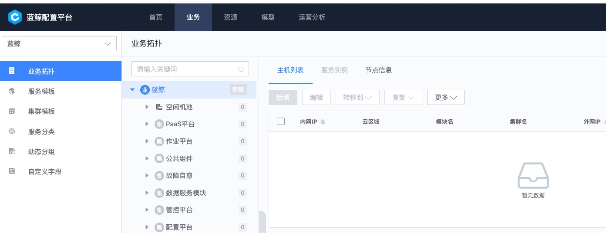

# 蓝鲸智云配置平台(BlueKing CMDB)

本文在蓝鲸cmdb`v3.9.5`上验证通过。

## 安装

### 目录和架构


* Web展示层 `cmdb_webserver`
* API网关层 `cmdb_apiserver`
* 服务层
  * 原子业务层
    * `cmdb_adminserver` 配置刷新、初始化数据写入等
    * `cmdb_eventserver` 事件订阅与推送
    * `cmdb_procserver` 系统进程
    * `cmdb_toposerver` 拓扑模型
    * `cmdb_hostserver` 主机
    * `cmdb_datacollection` 系统快照数据的采集
    * `cmdb_operationserver` 运营统计相关
    * `cmdb_synchronizeserver` 数据同步
    * `cmdb_taskserver` 异步任务管理
  * 资源管理层 `cmdb_coreservice`
* 存储层 `/data/sidecar/{mongodb,redis}`，提供数据存储、消息队列以及缓存 
* 服务注册发现 `/data/sidecar/zookeeper`

### Docker一键安装

```bash
docker run -d \
	--name=cmdb \
	--restart=always \
  -v /Users/jeffchen/bak:/tmp/export \
	-p 8090:8090 \
  -p 18080:8080 \
	ccr.ccs.tencentyun.com/bk.io/cmdb-standalone:v3.9.5
```

默认配置：

* zk `127.0.0.1:2181`
* mongo `cc:cc@127.0.0.1:27017`，db `cmdb`
* redis `127.0.0.1:6379`，pw `cc`
* web访问 <http://127.0.0.1:8090/>，默认用户`admin`，不用密码
* 内部`8080`端口是api服务
* `/tmp/export`是mongo导出数据的目录



## 使用

### 业务建模

常见名词解释：

* `业务`，指公司内部的一个项目或者产品，往往是一组相关服务（如：lb+web+db）的总体代表，是业务线的最小组成单元，有完整生命周期。
* `集群`，如果说业务是纵向概念，那么集群就是横向概念，代表空间区域的隔离，如：测试集群（可能公司内网）中的服务不应该访问生产集群（部署在公网云上）的接口，集群是可以扩缩容的，是高可用的基石，某种程度上来看，K8s体系中的Pod概念就是最小的集群。
* `模块`，是各种应用和服务的抽象：公司自研的App、Web是一种模块，数据库、中间件服务也是一种模块。每个模块都应该有对应的负责人。
* `主机`，和传统认知上的服务器有些区别，更接近Docker的实例概念：有IP地址、CPU核数、内存和磁盘容量、OS版本、运行状态，在这些基础上再扩充其他非必要属性，如：资产编号，所属区域等。

建模顺序：

1. `部门-员工`，基础字典，是其他模型中人员相关属性的选择列表数据源，由于开源版阉割了用户管理的功能，考虑用`关联关系`代替。
2. 导入`主机`进资源池
3. 新建`模块`，有负责人，自研服务有对应的git地址
4. 
5. `业务`，公司的产品，所属部门、对应的负责人、当前生命周期（默认：上线）
   1. 在`业务拓扑`界面，每个业务下建立对应的`集群-模块`
6. 

### 权限认证

Docker版服务默认不开启权限，直接以admin操作，非常不安全，解决方案有2种：

1. 使用原生服务：蓝鲸“全家桶”中的[PaaS平台](https://github.com/Tencent/bk-PaaS)，请看官方文档
2. 用自己的服务封装一层，大致思路如下：
> 1. cmdb实例和其他DB一样，部署在内部安全网络中，不允许外部直接访问
> 2. 只信任从指定网关地址过来的访问，实质是把权限解耦，托管给上游，参考[这一篇文章详细介绍](../权限管控/api_gateway_auth.md)。

### 接口调用

注意事项:

* 在请求head中添加`BK_USER=admin;HTTP_BLUEKING_SUPPLIER_ID=0`，否则会报错`[user]授权信息查询失败`
* api当前版本`v3`，建议直接看github上`docs/apidoc/v3.1`下的文档，官网上的有点过期
* 建议使用api_server的端口，需要对外暴露

```bash
# 查询主机列表，默认空库
curl --location --request POST 'http://0.0.0.0:18080/api/v3/hosts/search' \
--header 'HTTP_BLUEKING_SUPPLIER_ID: 0' \
--header 'BK_USER: admin'
```

反馈:

```json
{
    "result": true,
    "bk_error_code": 0,
    "bk_error_msg": "success",
    "permission": null,
    "data": {
        "count": 0,
        "info": []
    }
}
```

### 数据备份和恢复

mongo备份cmdb:

1. `docker exec -it cmdb /data/sidecar/mongodb/bin/mongodump --host 127.0.0.1 --port 27017 --out /tmp/export --db cmdb`
2. 打包压缩`tar -czvf cmdb.tar.gz /tmp/export/cmdb/`

从备份恢复（在mongo/bin目录）:
1. `docker exec -it cmdb /data/sidecar/mongodb/bin/mongorestore -h 127.0.0.1:27017 -d cmdb /tmp/export/cmdb/`

坑:

* docker版默认会初始化db，写入部分业务模型，导致从备份导入后，出现重复记录

### 对接密码管理

由于cmdb有对接外部系统的需求，一些ci的账号信息不适合直接明文存储，这里提供一种解决思路，供参考：

> KeePassXC 一种安全开源\跨平台的密码加密、存管工具

1. ci记录的密码属性信息存入KeePassXC管理的.kdbx加密库中
2. 基于py库`pykeepass`构建密码查询接口，入参(ci分类, ci.id, [属性kv])，反馈解密后的报文（如：密码）
3. 在业务流程开发时，通过上面的接口，读取密码

## TODO

* 主机信息自动采集和注册
* 对接统一服务平台入口

## 参考

* github源码 <https://github.com/Tencent/bk-cmdb>
* 官网文档 <https://bk.tencent.com/docs/document/5.1/9/222>
