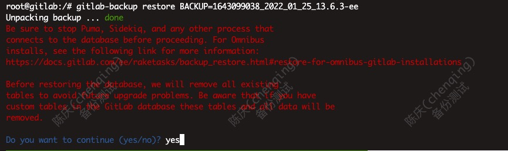
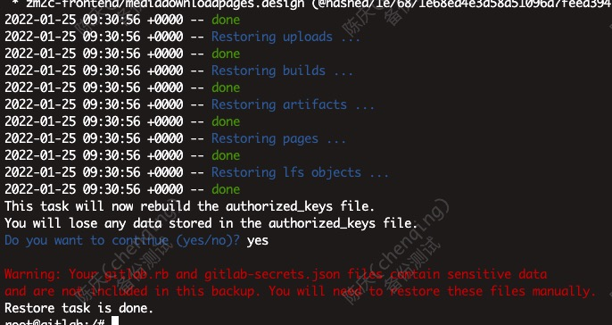
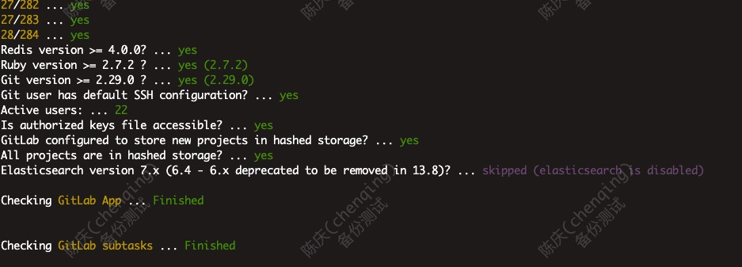

# Gitlab 代码版本管理

## 安装

基于docker，版本13.6.3，Ubuntu18上测试通过

前提：
* 硬件配置 4C-8G-100G
* 安装 docker

```bash
# 服务存储路径 
cd /data/gitlab

docker run --detach \
  --hostname gitlab.test.com \
  --publish 443:443 --publish 80:80 --publish 10022:22 \
  --name gitlab \
  --restart always \
  -v /data/gitlab/ca/license_key.pub:/opt/gitlab/embedded/service/gitlab-rails/.license_encryption_key.pub \
  -v /data/gitlab/ca/license.rb:/opt/gitlab/embedded/service/gitlab-rails/ee/app/models/license.rb \
  --volume /data/gitlab/config:/etc/gitlab \
  --volume /data/gitlab/logs:/var/log/gitlab \
  --volume /data/gitlab/data:/var/opt/gitlab \
  gitlab/gitlab-ee:13.6.3-ee.0

# 设置安全访问
iptables -I DOCKER -p tcp -m tcp --dport 22 -j DROP
iptables -I DOCKER -s 10.0.0.0/23 -p tcp -m tcp --dport 22 -j ACCEPT
```

* `/data/gitlab/ca/`下是https的证书

## 备份

```bash
# 调用内部命令备份数据，不含配置，生成{时间戳}_{gitlab版本}_gitlab_backup.tar
docker exec -t gitlab gitlab-backup create
# 备份配置，包括配置和https证书
zip gitlab_config.zip -r /data/gitlab/config/ /data/gitlab/ca/
```

## 恢复

在另一台主机上恢复

1. gitlab_config.zip解药到对应目录
2. gitlab_backup.tar复制到`/data/gitlab/data/backups`，文件权限开777
3. 在容器内执行

```bash
# 暂停服务
gitlab-ctl stop unicorn
gitlab-ctl stop puma
gitlab-ctl stop sidekiq
# gitlab-ctl status验证服务是否关闭
# 执行恢复，1643099038_2022_01_25_13.6.3-ee是之前备份的{时间戳}_{gitlab版本}
gitlab-backup restore BACKUP=1643099038_2022_01_25_13.6.3-ee
```




4. 退出容器后，重启gitlab
5. 验证服务恢复 `docker exec -it gitlab gitlab-rake gitlab:check SANITIZE=true` 
6. 验证2：本地hosts里指定新主机ip和域名，尝试访问

## 参考

* 官网文档 <https://docs.gitlab.com/>