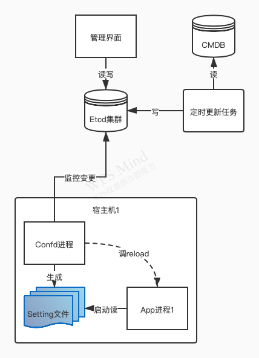

# 基于confd的本地服务配置管理

## 目的

介绍一种通用的、管理本地微服务配置的技术方案

### 痛点

* 每台主机上有多个微服务，每个微服务都有自己的setting文件
* 当配置需要更新时，需要更新setting后重启

## 架构

## 实例

TODO

## 参考

* [Confd手册](../../tech_tutorial/中间件/confd.md)
* [Etcd手册](../../tech_tutorial/DB/etcd.md)
* [Mug框架](../../自研项目/MugWeb框架/index.md)